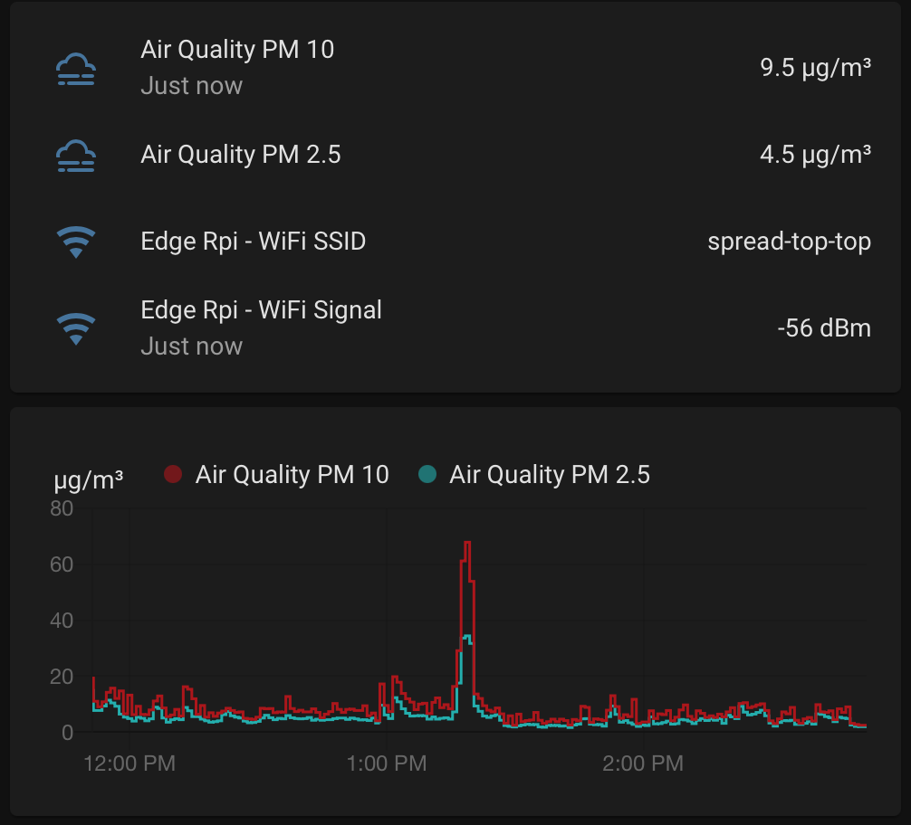
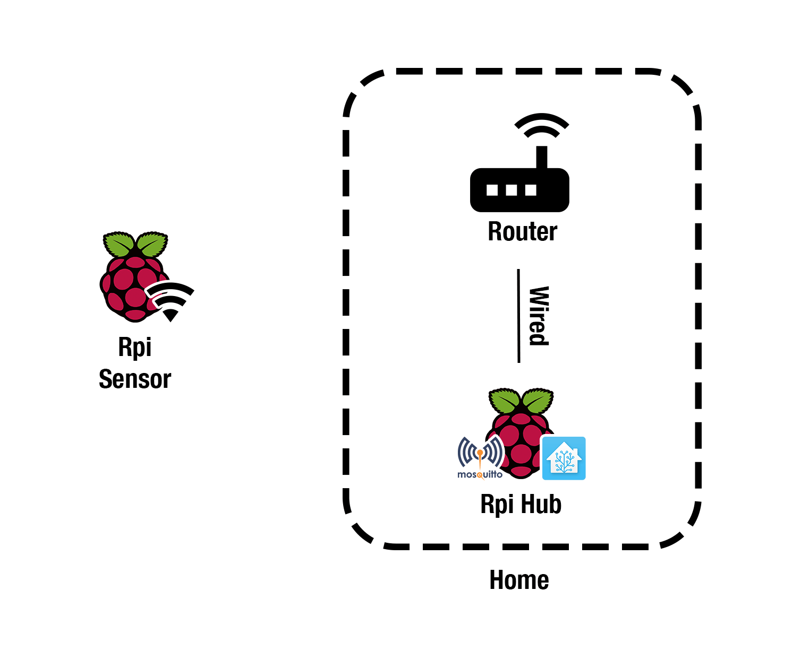
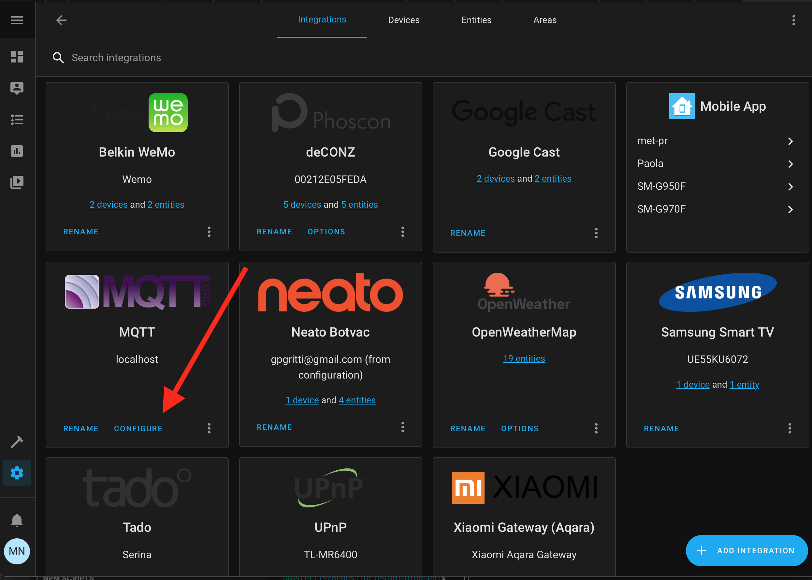
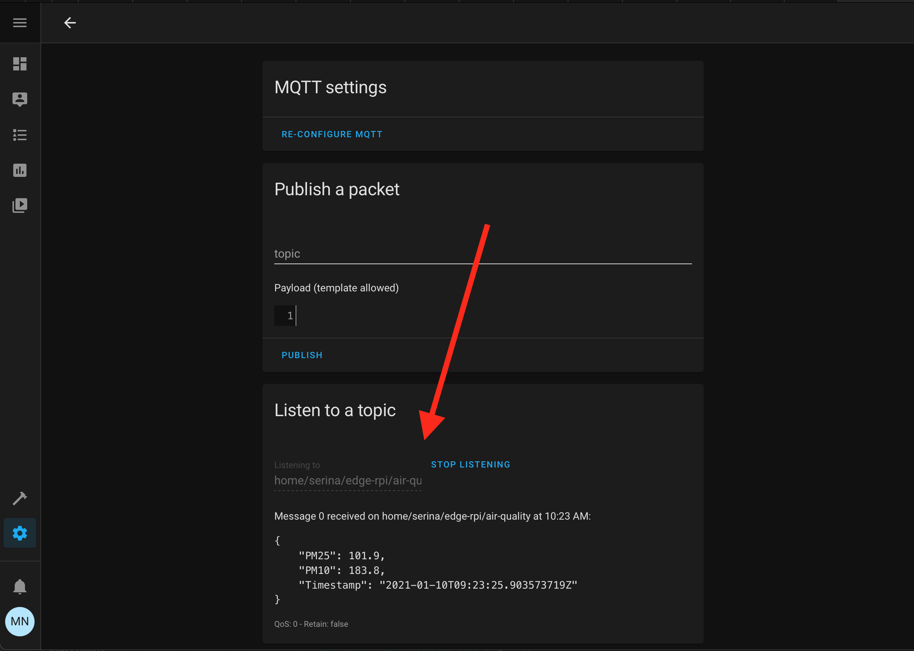
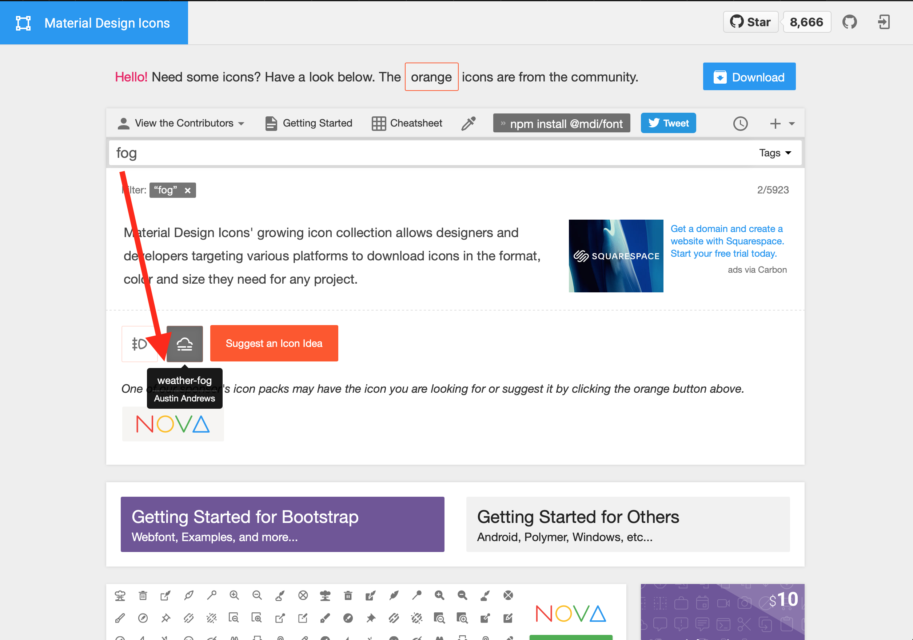
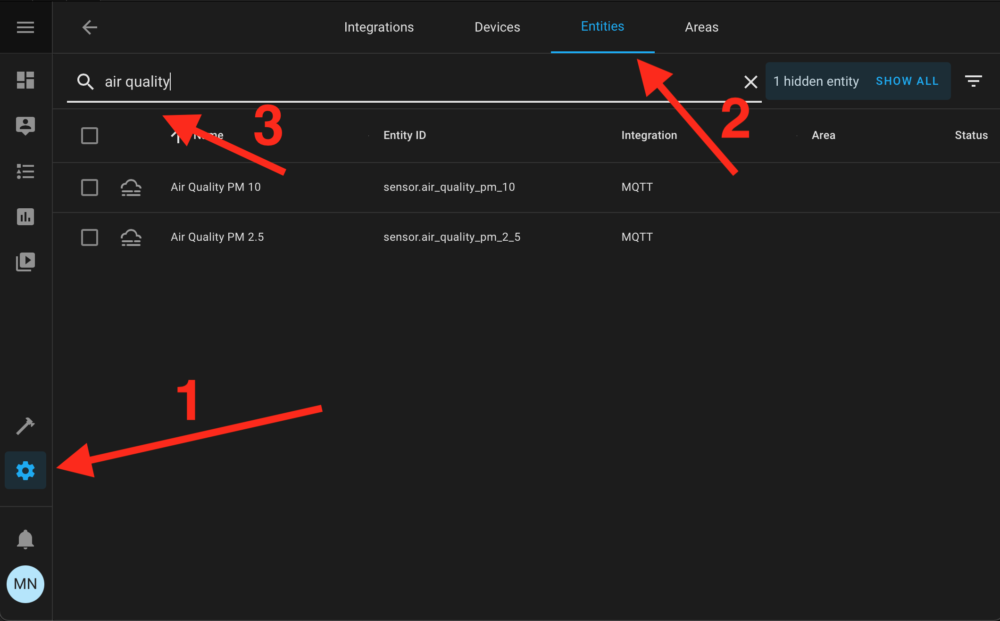
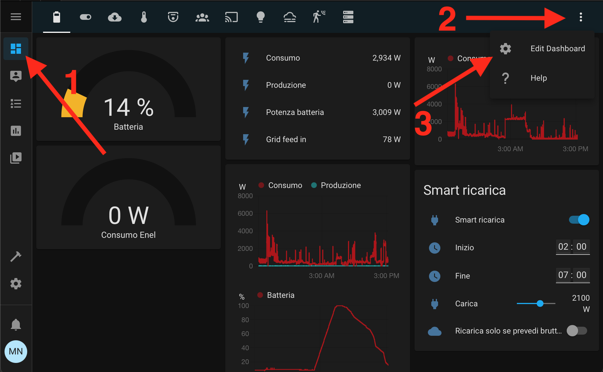
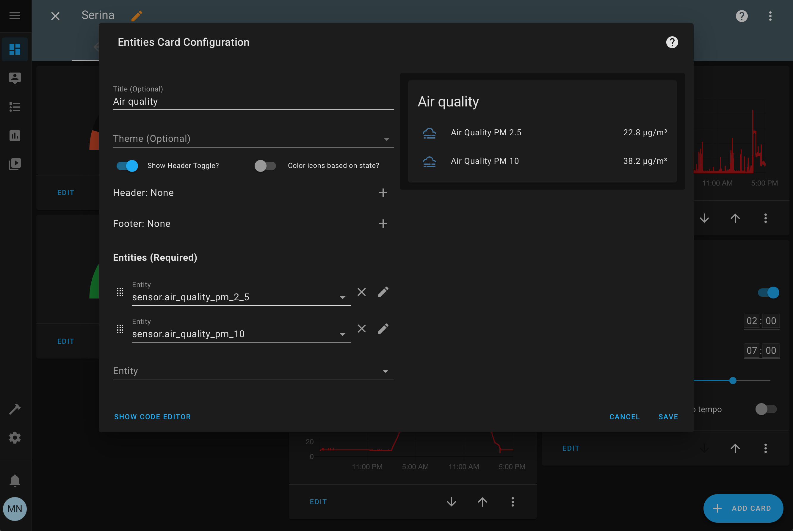
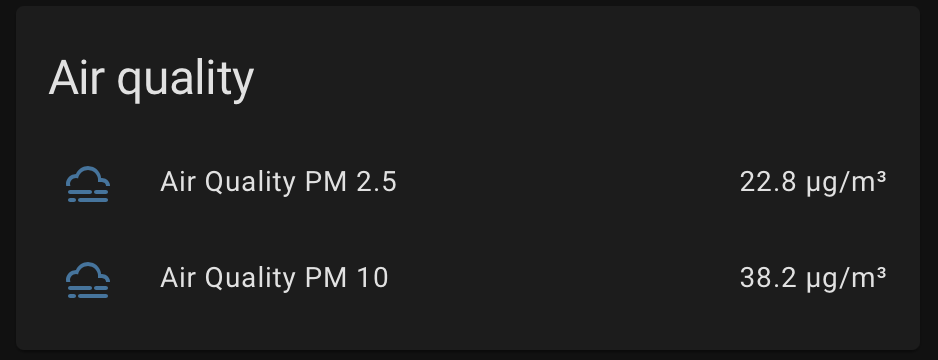
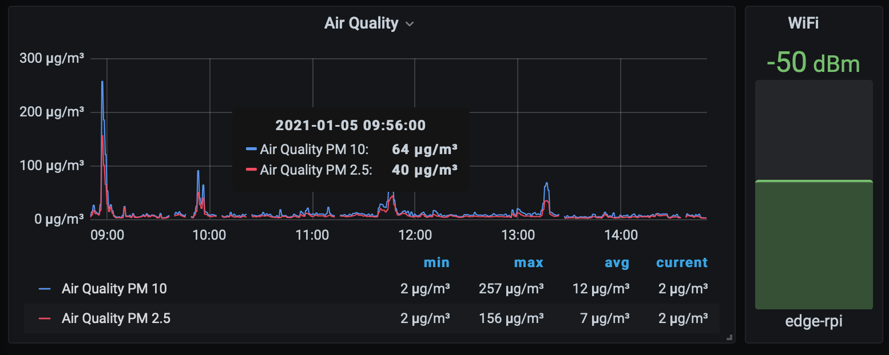

I live in Milan and I was wondering how much the air is polluted. So I started learning how to build an air quality sensor and how to integrate it in my Home Assistant. Then I regretted it because I understood the Milan air quality is very awful! It's not breaking news, but it's different having your air quality sensor that analyzes the air you're breathing instead of hearing the news on TV that says: "Milan had stopped the traffic to lower the emissions because it's above the limits". Then I moved the sensor to Serina, a little town lost in the mountains, where the air quality is much better!

Now I want to share my learning: how to create the same air quality sensor I built, and how to read this data into Home Assistant just like this



## The hardware we need

To reach this goal we need:

- 2 Raspberry Pis and related power adapter and SD Cards: one will be the air quality sensor (*Rpi Sensor*), the other one will be our receiver with Home assistant (*Rpi Hub*). You also need a WiFi USB dongle if the air quality Raspberry Pi doesn't have built-in.
- The air quality sensor SDS011: this hardware is commonly shipped with the USB dongle, so it's easy to attach to the Raspberry Pi.

## The software we use

- [Mosquitto](https://mosquitto.org): open source message broker that implements MQTT protocol. [MQTT protocol](https://en.wikipedia.org/wiki/MQTT) is widely used in IoT system because it performs very well under extreme conditions like weak WiFi signal, and very limited WiFi bandwidth.
- [Home Assistant](https://www.home-assistant.io): open-source home automation system.

I'm currently using a Mac, so all the commands you see will work on Mac or Linux terminal. If you are using Windows you have two options:

- [Install WSL](https://docs.microsoft.com/en-us/windows/wsl/install-win10).
- Use a virtual machine with Linux installed using [VirtualBox](https://www.virtualbox.org).

## What we learn

Someone can say: "Hey! You are a liar! You're not building an air quality sensor, you've just bought that!". Maybe he is right, but I think the sensor is just the tip of the iceberg. We have a lot of work to extract the data from the sensor and make them useful.

The overall architecture we want to build is shown in the next figure



So through this tutorial, we will learn:

- How to create a program that extracts data from the sensor. We will write it in [Go](https://golang.org). To simplify the development we will learn how to cross-compile the binary for ARM architecture using our PC/Mac that has a different architecture than the Raspberry Pi.
- How to automatically connect the Raspberry Pi with the sensor to the WiFi with the strongest signal, how to automatically reconnect if we have some outage.
- How to start automatically the Go program if there are some issues.
- How to pass data using MQTT protocol and how to digest those inside [Home Assistant](https://www.home-assistant.io).

Now that we have the overall picture in our minds, let's get started!

## Build the Raspberry Pi with the air quality sensor

Let's start with the Raspberry Pi with the air quality sensor.
**The first thing we need is [install the Raspberry Pi OS Lite](https://www.raspberrypi.org/documentation/installation/)**. We just need the lite because we just use the terminal and [we will connect using SSH](https://www.raspberrypi.org/documentation/remote-access/ssh/README.md).

Now we are ready to attach the SD card to the Raspberry, attach the ethernet port to connect it to our home network for the first setup, attach the SDS011 sensor using the USB. The Raspberry Pi should automatically detect it.

Let's check it out: connect to this Raspberry Pi using via SSH using `ssh pi@<RPI_SENSOR_IP>`, with password `raspberry`. Change `<RPI_SENSOR_IP>` with the Raspberry Pi sensor IP address. I usually find its IP address through my router control panel, or just type on the terminal `ping raspberrypi.local`. You should find something like this

```bash
PING raspberrypi.local (192.168.1.123): 56 data bytes
64 bytes from 192.168.1.123: icmp_seq=0 ttl=64 time=13.452 ms
64 bytes from 192.168.1.123: icmp_seq=1 ttl=64 time=17.451 ms
--- raspberrypi.local ping statistics ---
2 packets transmitted, 2 packets received, 0.0% packet loss
round-trip min/avg/max/stddev = 13.452/15.451/17.451/2.000 ms
```

The IP you see there, it's the IP you're looking for.

Now that we are connected via SSH, we type `lsusb` to check the Raspberry Pi sees the sensor

```bash
pi@edge-rpi:~ $ lsusb
Bus 001 Device 005: ID 1a86:7523 QinHeng Electronics HL-340 USB-Serial adapter
Bus 001 Device 004: ID 2001:330d D-Link Corp.
Bus 001 Device 003: ID 0424:ec00 Standard Microsystems Corp. SMSC9512/9514 Fast Ethernet Adapter
Bus 001 Device 002: ID 0424:9512 Standard Microsystems Corp. SMC9512/9514 USB Hub
Bus 001 Device 001: ID 1d6b:0002 Linux Foundation 2.0 root hub
```

You should see some Chinese names like "QinHeng Electronics HL-340". This is our sensor. If we type `ls /dev/ttyUSB*` we should see `/dev/ttyUSB0` as response: this is our channel to communicate with the sensor.

### Compile the Go program to fetch data

Now we should create a program that fetches data from `/dev/ttyUSB0` created by the sensor and publishes those on an MQTT topic.

If you don't know MQTT, don't worry: [Wikipedia explains briefly what it is](https://en.wikipedia.org/wiki/MQTT). This is my explanation: it's a lightweight protocol that relies on topics. Someone publish something on a topic, like the air quality sensor data. **Someone else can subscribe to that topic, in that way he's notified whenever there's new data on that topic**. Maybe you are more comfortable with the HTTP protocol, but I think that MQTT is best suited for this kind of application.

I made this application for you in Go. [You can find it on GitHub](https://github.com/matitalatina/sds011-mqtt).
We should change the configuration that is in `cmd/sensor/main.go`, the file should be like this

```go
package main

import "mattianatali.it/sds011-mqtt/internal/sensor"

func main() {
  c := sensor.Config{
    Topic: "home/serina/edge-rpi/air-quality",
    SensorPortPath: "/dev/ttyUSB0",
    CycleMinutes: 1,
    MqttBroker: "tcp://192.168.1.117:1883",
  }
  sensor.Start(c)
}
```

- Change the `Topic` with a string of your choice. I had his convention `home/<HOME_IDENTIFIER>/<DEVICE_IDENTIFIED>/<DATA>`. The topic is just a string that refers to where we want to publish the data and then where we want to subscribe to fetch them.
- `SensorPortPath`: should be the same, it's where we fetch the sensor data.
- `CycleMinutes`: Change it if 1 sample/minute is too much for you. You can't put less than 1 minute.
- `MqttBroker`: You should put the IP address of the Raspberry Pi where we put Mosquitto, the message broker that handles our MQTT topics. I suggest you use the same Raspberry Pi where you install also Home Assistant.

If you are curious, you can see the implementation in `internal/sensor/main.go`.

**Now it's time to cross-compile it for our Raspberry Pi!** I'm expecting that you have downloaded this source code on your Mac/PC and you have [Go installed](https://golang.org/doc/install). Then, we need to know what type of architecture your Raspberry Pi has.

Launch this command on the Raspberry Pi: `cat /proc/cpuinfo`
You should see something like this

```bash
cat /proc/cpuinfo

processor : 0
model name : ARMv6-compatible processor rev 7 (v6l)
BogoMIPS : 697.95
Features : half thumb fastmult vfp edsp java tls
CPU implementer : 0x41
CPU architecture: 7
CPU variant : 0x0
CPU part : 0xb76
CPU revision : 7

Hardware : BCM2835
Revision : 0002
Serial : 00000000cdea9a84
Model : Raspberry Pi Model B Rev 1
```

My raspberry has `ARMv6`, so I need to compile for that type. If you have a Raspberry Pi 2 you should see `ARMv7`.
I created a [Makefile](https://github.com/matitalatina/sds011-mqtt/blob/main/Makefile) to simplify the cross-compilation. Makefile is very common on Linux, it's used to simplify common tasks. If you don't know about it I suggest reading [Learn make in Y minutes](https://learnxinyminutes.com/docs/make/).

- If you have `ARMv6`, just type `make build-arm6` in the folder where you downloaded my [GitHub Project](https://github.com/matitalatina/sds011-mqtt).
- If you have `ARMv7`, type `make build-arm`.

Now we should have a binary file located in `dist/pm-sensor`. We should transfer to our Raspberry Pi sensor. We will use the command [scp](https://linuxize.com/post/how-to-use-scp-command-to-securely-transfer-files/).

```bash
scp dist/pm-sensor pi@<RPI_SENSOR_IP>:
```

As usual, change `<RPI_SENSOR_IP>` with the real IP, but leave the colon at the end. This means we're going to place the `pm-sensor` in the home folder of our user `pi` inside the Raspberry Pi.

Now we can enter via SSH in the Raspberry Pi, we should see our new binary file called `pm-sensor`. If we try to run, it fails

```bash
# Add execute permission to the script
sudo chmod +x ./pm-sensor
# Start it
./pm-sensor
# This is the program output
panic: Network Error : dial tcp 192.168.1.118:1883: connect: connection refused

goroutine 1 [running]:
mattianatali.it/sds011-mqtt/internal/sensor.Start(0x12d3bcd, 0x20, 0x12cc844, 0xc, 0x1, 0x12d0ec0, 0x18)
 /Users/mattia/Repositories/sds011-mqtt/internal/sensor/main.go:28 +0x7e5
main.main()
 /Users/mattia/Repositories/sds011-mqtt/cmd/sensor/main.go:12 +0xac
```

it's complaining because it can't connect to the MQTT broker to publish the sensor data. It is right, we don't have prepared the other Raspberry Pi.

Now we leave the sensor for a moment, and we'll work on the Raspberry Pi that is inside our home, we call it *Hub* for simplicity.

## Add mosquitto to the Raspberry Pi Hub

**Now it's time to set up the "receiver" part of the architecture.** So we need the other Raspberry Pi with a clean Raspberry OS installed.

Then [we install Mosquitto](https://mosquitto.org/blog/2013/01/mosquitto-debian-repository/)

```bash
wget http://repo.mosquitto.org/debian/mosquitto-repo.gpg.key
sudo apt-key add mosquitto-repo.gpg.key
cd /etc/apt/sources.list.d/
sudo wget http://repo.mosquitto.org/debian/mosquitto-buster.list
apt-get update
sudo apt-get install mosquitto
```

The new version of Mosquitto [added the authentication by default for very good reasons](https://mosquitto.org/blog/2020/12/version-2-0-0-released/). I started this project when Mosquitto didn't have authentication by default, so my script doesn't support it, yet. To enable support for anonymous users we should add these two lines in the file `/etc/mosquitto/mosquitto.conf`

```
listener 1883
allow_anonymous true
```

The first one enables the incoming messages from different hosts to the port 1883. This is required because our sensor is not on this Rpi Hub. The second one enables anonymous users.

**We make sure that Mosquitto is working**, it takes the new config file, and **it's starting on Raspberry boot**.


```bash
# Restart mosquitto to get the new config file
sudo systemctl restart mosquitto

# Make sure mosquitto is enabled on startup
sudo systemctl enable mosquitto
```

**Now we have the MQTT Broker up and running!** It means that our sensor can send the data to this broker. Let's test if our sensor can send data to this broker.

```bash
# Connect to Raspberry Pi sensor and type the password
ssh pi@<RPI_SENSOR_IP>
# Start the Go program to send air quality data
./pm-sensor
# This is the expected output (1 line every one minute)
2021-01-06T05:58:15Z,8.4,21
2021-01-06T05:59:15Z,10.5,60.9
2021-01-06T06:00:15Z,8.5,48.9
2021-01-06T06:01:15Z,12.3,99.5
2021-01-06T06:02:15Z,20.1,214.3
2021-01-06T06:03:14Z,17.6,183.2
2021-01-06T06:04:14Z,16.5,173.7
2021-01-06T06:05:14Z,10.4,52.2
```

This is a really good sign! It means we can fetch data from our quality sensor and we can send them to our MQTT broker that it's installed on our Raspberry Pi Hub!

To double-check it, **we leave the program active** and we subscribe on the topic we are sending data to

```bash
# We connect to Raspberry Pi Hub
ssh pi@<RPI_HUB_IP>
# We subscribe to our topic
mosquitto_sub -t 'home/serina/edge-rpi/air-quality'
# We should see an output like this
{"PM25":14.8,"PM10":18.6,"Timestamp":"2021-01-06T13:42:08.33019206Z"}
{"PM25":14.5,"PM10":16.2,"Timestamp":"2021-01-06T13:43:08.192798603Z"}
{"PM25":8.7,"PM10":9.7,"Timestamp":"2021-01-06T13:44:08.057092356Z"}
```

You should change `<RPI_HUB_IP>` with the IP of your Hub and replace `home/serina/edge-rpi/air-quality` with the topic you have inserted in the Go configuration inside the property `Topic`.

Now we know what our Go program publish on the topic: it sends a JSON file with three properties:

- `PM25`: contains the PM 2.5 expressed in `µg/m^3`.
- `PM10`: contains the PM 10 expressed in `µg/m^3`.
- `Timestamp`: contains the time in [ISO 8601](https://en.wikipedia.org/wiki/ISO_8601) when it fetched the data.

### Recap

Congratulation! **Now we have a sensor that fetches air quality data and sends them to an MQTT broker, every application that wants this data should subscribe to the chosen topic** and that's it! Are we finished?

Well... Not exactly.

We want to put the sensor outside, so we should use the WiFi and detach the Ethernet port. We don't want to connect to the sensor to start the program. If we put the sensor far away from our router, the sensor should be able to reconnect every time automatically, it should do the same if we restart the router. We have all these issues to fix!

So let's pimp up our sensor to make it wireless and smart enough to keep the connection on automatically.

## Pimp the sensor!

### Make the program start automatically

The program doesn't start automatically. We have to connect via SSH and start it with the command `./pm-sensor`. This is very frustrating.

To reach this goal, **we take leverage of [systemd](https://en.wikipedia.org/wiki/Systemd)**. Systemd is the system and service manager for the Raspberry Pi. Did you notice we have already used systemd in this tutorial? When we started mosquitto we wrote

```bash
sudo systemctl restart mosquitto
sudo systemctl enable mosquitto
```

using the command `systemctl` we can start/stop/restart the services on a Linux machine. And we can also start automatically a service on boot if we write `sudo systemctl enable <SERVICE>`. So we need to create a service for our pm-sensor program.

Luckily it's very easy: the custom services are stored in the folder `/etc/systemd/system`. So we can add the new service, if we add the file called `pm-sensor.service` in that folder. The content of that file is the following

```
[Unit]
Description=PM Air Quality Sensor
After=network-online.target
Wants=network-online.target

[Service]
Type=simple
User=pi
Group=pi
ExecStart=/home/pi/pm-sensor
Restart=always
RestartSec=10

[Install]
WantedBy=multi-user.target
```

As you can see, the service declaration consists of three sections: `[Unit]`, `[Service]` and `[Install]`.

- In the `[Unit]` section we put a little description of our service and we declare that we want the network up and running before starting it.
- `[Service]` declare the type of the service, the name, and the group of the user that should start the script, where the program is located and we define how systemd should behave if the service panics. We want the program to always restart.
- `[Install]` defines that this service does not need the graphical user interface.

Systemd is a very big topic and it deserves a complete book on it. I know this explanation scratches only the surface, but it's enough for our purposes. But I know you're very curious! So if you want to dig deeper you can type `man systemd.unit` and `man systemd.service` on your Linux machine. In linux, if you want to know something more just type `man <PROGRAM_YOU_WANT_TO_LEARN_MORE>`.

Now that we have created the service, we need to reload the systemd configuration, start the program, and enable it during startup.

```bash
sudo systemctl daemon-reload
sudo systemctl start pm-sensor
sudo systemctl enable pm-sensor
```

We can check if everything is started correctly with the following command

```bash
sudo systemctl status pm-sensor
# This is the output we got
● pm-sensor.service - PM Air Quality Sensor
 Loaded: loaded (/etc/systemd/system/pm-sensor.service; enabled; vendor preset: enabled)
 Active: active (running) since Wed 2021-01-06 15:01:26 GMT; 1h 43min ago
 Main PID: 1182 (pm-sensor)
 Tasks: 5 (limit: 272)
 CGroup: /system.slice/pm-sensor.service
 └─1182 /home/pi/pm-sensor

Jan 06 16:36:01 edge-rpi pm-sensor[1182]: 2021-01-06T16:36:01Z,21.2,33.9
Jan 06 16:37:00 edge-rpi pm-sensor[1182]: 2021-01-06T16:37:00Z,61.1,303.4
```

Everything is ok, we should also see the logs of our program.

We don't need to start manually the program anymore! But we are still connected via Ethernet, we can't put our sensor outside our home. Let's fix it!


### Add WiFi connection

The best way to add the WiFi in the Raspberry Sensor is by [reading the official documentation](https://www.raspberrypi.org/documentation/configuration/wireless/wireless-cli.md), it's useless to copy-paste. I suggest adding all your WiFi SSID that you have in your home. In this way, you set up the sensor just one time. If you want to move it to another place, it tries to connect to the nearest WiFi access point.

Be aware that now **the sensor IP address could be changed**. So remember to get the new address.

### Keep WiFi persistent

Now we can put our sensor outside! It automatically connects to our WiFi and starts our program that fetches the sensor. We should be proud of our work until now... But we realize soon that there's a problem. We realize it when we reboot our router or we put our sensor too far from it: **the Raspberry Pi doesn't try to reconnect the WiFi if it loses the connection**!

Let's fix it. I found a little script on the web and I adapted it for our purposes. We create the file `check-wifi.sh`

```bash
# Connect to sensor Raspberry Pi
ssh pi@<RPI_SENSOR_IP>

# Create the new file
touch check-wifi.sh

# Add execution permission on it
chmod +x check-wifi.sh
```

we put this content inside it

```bash
#!/bin/bash

##################################################################
# Settings
# Which Interface do you want to check/fix
wlan='wlan0'
# Which address do you want to ping to see if the network interface is alive?
pingip='192.168.1.1'
##################################################################

echo "Performing Network check for $wlan"
/bin/ping -c 1 -I $wlan $pingip > /dev/null 2> /dev/null
if [ $? -ge 1 ] ; then
  echo "Network connection down! Attempting reconnection."
  sudo ip link set $wlan down
  sleep 5
  sudo ip link set $wlan up
else
  echo "Network is Okay"
fi
```

The script should be self-explanatory. We have two variables at the top: `wlan` that you should not change and `pingip` where you put your router IP address.

The script tries to ping the router, if it reaches the router, everything is fine. If it can't do it, it disables the WiFi, and then it enables again. It should trigger the reconnection.

**We need someone that calls this script every minute... [cron](https://en.wikipedia.org/wiki/Cron) to the rescue!** This is the common way to do such things on Linux.

To add a scheduled job that triggers our script every minute, we need to write `crontab -e` in the terminal. It will open a text editor.
On that page write this stuff

```bash
* * * * * /home/pi/check-wifi.sh
```

This strange syntax can be scary but it's very easy. The first part, the `* * * * *` indicate when the script should trigger. The last part refers to the script we want to launch.
The scheduled time is always represented by five values. The order of them changes the meaning of those asterisks. From left to right they refer to:

- Minute (0 - 59)
- Hour (0 - 23)
- Day of month (1 - 31)
- Month (1 - 12)
- Day of the week (0 - 6): Sunday to Saturday

But we put `*`... Not numbers. We added asterisks because it has a special meaning. `*` means "any". So we wrote: "Please Linux, run the script `/home/pi/check-wifi.sh` every minute of every hour of every day of the month of every day of the week". Linux is smart enough to understand he should trigger the script every minute from now on.

**We have a very robust air quality sensor now!** We can put it outside our home and no matter what happens, it should keep always the connection as long as it reaches our router WiFi signal.

**Using `mosquitto_sub` is the only way to see the data from the sensor**. This is ok only for debugging purposes, we should have a better way to see those data. **[Home Assistant](https://www.home-assistant.io) will solve this problem**.

## Add sensor to Home Assistant

### Install and learn Home Assistant

[Home Assistant](https://www.home-assistant.io) is a great piece of software. If you are a tech enthusiast that loves automating home, I think you have already installed it.

If you don't know yet: you can attach smart devices to it and you can create rules to automate things. You can also attach sensors to easily see the data. In other words, if you decide to install it, Home Assistant can become the control center of your home.

**Seeing the sensor data in the Home Assistant is our goal here.**

As the first step, [we need to install it](https://www.home-assistant.io/docs/installation/) on the Raspberry Pi Hub.
Then, I suggest you read the [configuration manual](https://www.home-assistant.io/docs/configuration/). Home Assistant heavily uses [YAML files](https://learnxinyminutes.com/docs/yaml/) to install custom sensors like ours.

Maybe you're thinking that Home Assistant is overkill for seeing just sensor data. But I think this is only the starting point: I'm sure that in the end, you will have more than 20 devices with a total of 200 sensors attached and dozens of automation that orchestrate everything!


So it's not overkill, it's only our starting point, trust me 😊.

Now that we have installed Home Assistant and learned about [where its configuration is installed](https://www.home-assistant.io/docs/configuration/), **it's time to add our sensor**.

### Add MQTT integration

**We need to add the MQTT integration to Home Assistant.** Go to the Home Assistant portal, it should be exposed on port `8123`. So open the browser and type the URL `http://<RPI_HUB_IP>:8123` where `<RPI_HUB_IP>` is the IP of our Raspberry Pi Hub. Click the cog icon (Configuration) and click on "Add integration". We can see a huge list of integration, we are interested in MQTT. So search for that and then it will ask for two mandatory fields:

- Broker: you need to add the Raspberry Pi Hub IP. It's where we installed Mosquitto, our MQTT broker.
- Port: it's `1883`. We put that in the mosquitto configuration.

Click submit and now we have linked Home Assistant to our MQTT broker Mosquitto.

We should see the brand new integration in Configuration -> Integration Tab. We click on configure



and then we can listen to our MQTT topic, just to check if Home Assistant can see our data.

In the section "Listen to a topic", write down our chosen MQTT topic, click "start listening" and wait at least 1 minute. The wait depends on the configuration you set on our Go program. If you don't change my value, it should publish one date per minute.

If you see the data like the figure below, you have successfully attached Home Assistant to our MQTT Broker!




### Add air quality sensors through the MQTT platform

We know that the values are published on an MQTT topic (you chose the name, mine is `home/serina/edge-rpi/air-quality`). We should create two sensors that subscribe to that topic and extract data. These sensors will be

- Air Quality PM 10.
- Air Quality PM 2.5.

To achieve this goal, we edit the Home assistant `configuration.yaml` file. We need to add these two sensors inside the `sensor:` section.

```yaml
sensor:
  - platform: mqtt
    state_topic: "home/serina/edge-rpi/air-quality"
    unit_of_measurement: "μg/m³"
    icon: "mdi:weather-fog"
    value_template: '{{value_json.PM10 | float}}'
    name: 'Air Quality PM 10'
    unique_id: 'rpi-edge:air-quality-pm-10'
  - platform: mqtt
    state_topic: "home/serina/edge-rpi/air-quality"
    unit_of_measurement: "μg/m³"
    icon: "mdi:weather-fog"
    value_template: '{{value_json.PM25 | float}}'
    name: 'Air Quality PM 2.5'
    unique_id: 'rpi-edge:air-quality-pm-2.5'
```

Luckily, the YAML file is very readable. We are using [MQTT sensor platform](https://www.home-assistant.io/integrations/sensor.mqtt/). We restart the Home Assistant.

You should change `state_topic` with yours. You can also change the `unique_id` with any value unless is unique, of course.

`value_template` is the field where we extract the value from JSON in the topic with the keyword `value_json` and then we take the interesting values `PM10` and `PM25`. Finally, we say that we are interested in a `float` value. All this stuff is surrounded by `{{ }}`: when you see this syntax means we are exploiting the [template system](https://www.home-assistant.io/docs/configuration/templating/) that is powered by [Jinja2](https://www.home-assistant.io/docs/configuration/templating/).

If you want to change the icon of the sensor, I usually [use this website](https://materialdesignicons.com). For example, I search
for a keyword, `fog`, and finally I hover the mouse on the chosen icon. You should prepend the name it appears with `mdi:`. In our example is `mdi:weather-fog`.




## Add sensors to Home Assistant UI

Now we should have two new entities that show air quality. To see them, we should go to configuration -> entities and search for "Air quality"



as you can see, it's quite uncomfortable. It's better to put those entities on the overview/dashboard page.

In the Home Assistant, click on overview on the left bar, the three dots on the right, edit dashboard, and finally "Add card" on the bottom. A modal should appear, click on the "Entities" choice.



Write the title that you want; in the "entities" section, search for the entities we saw earlier. You should see a preview of the new card at the bottom. When you're satisfied click "Save" and we're done!



Now we should have this nice card every time we open Home Assistant! If we click on that, we should see also a graph for the last day.



## Conclusions

We finally reach the end of this journey. I hope you learn something new and appreciate the beauty of making an air quality sensor by yourself.

I would like to tell you more about it: for example, I don't explain how to see this data on [Grafana](http://grafana.com)



or how to see the WiFi SSID and its signal strength directly on Home Assistant.


I'll talk about them in other blog posts because this is already very long.

If you want to be updated, leave your email below and I'll notify you. Or simply visit my blog from time to time.

See you!
