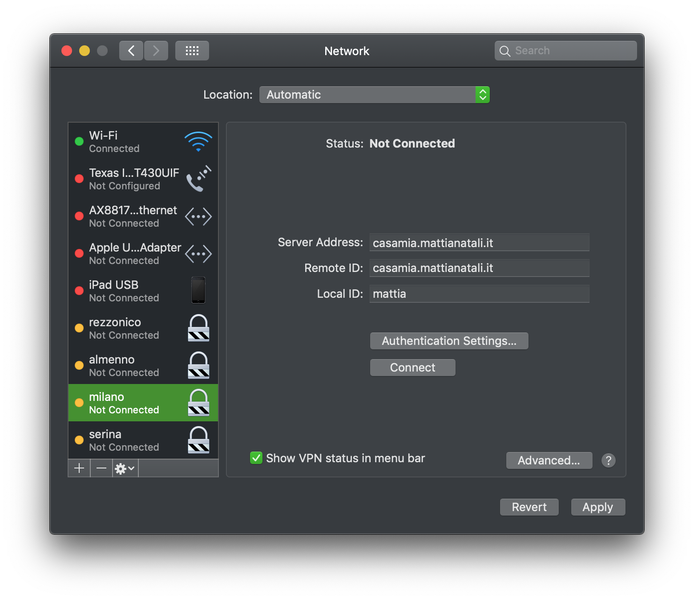

## Introduzione

Siete al lavoro e avete il compito di configurare 20 macchine virtuali tutte allo stesso modo? Siete a casa e avete il vostro Raspberry Pi che purtroppo ha corrotto l'SD card e quindi dovete riconfigurarlo per l'ennesima volta? Allora **Ansible potrebbe risolvere molti dei vostri problemi**!

Se siete come me sono certo che non vi piace passare la giornata ad eseguire task ripetitivi che danno praticamente zero valore aggiunto a voi stessi: **eseguire task ripetitivi non è un compito da far svolgere a noi umani**, possiamo benissimo delegarlo alle macchine per poterci dedicare a cose che veramente contano.

Come facciamo ad automatizzare questi task? Una risposta sicuramente efficace è [Ansible](https://www.ansible.com/), lo strumento di configurazione che preferisco.

## Obiettivo

Se avete avuto di leggere la [documentazione ufficiale di Ansible](https://docs.ansible.com/ansible/latest/user_guide/quickstart.html), sono certo che avrete notato che è tanto noiosa quanto è potente il tool stesso. È facile che vi addormentiate a leggerla ancor prima di capire le reali potenzialità di Ansible.

Ecco che allora ho deciso di scrivere questa mini guida sperando che sia un po' più efficace. Spero di raggiungere questo obiettivo tramite un esempio concreto che è mi è capitato e che utilizzo tutt'ora: **andremo a configurare un [VPN Server](https://it.wikipedia.org/wiki/Virtual_Private_Network) su un [Raspberry Pi](https://www.raspberrypi.org/)**.

Grazie a questo playbook di Ansible, possiamo creare un VPN Server su un Raspberry Pi lanciando un unico comando `ansible-playbook -vv -i hosts vpn.yml`. **Le funzioni che esegue sotto le quinte sono molte**:

- Scarica il certificato tramite https://letsencrypt.org/ del dominio che sta puntando a casa nostra, per esempio `casamia.mattianatali.it`.
- Imposta il rinnovo automatico del certificato stesso.
- Apre le porte corrette sul Raspberry Pi per far funzionare la VPN.
- Installa tutte le librerie ed applicazioni necessarie per installare il VPN Server.
- Configura correttamente le impostazioni che decidiamo noi per la VPN, per esempio l'utente per accedervi.
- Imposta l'aggiornamento automatico dei certificati in base al rinnovo del certificato di Let's Encrypt.

Immaginate ora se non avessimo avuto Ansible che facesse tutte queste cose con un comando. Sicuramente dopo 2 giorni che ho eseguito manualmente questi comandi mi sarei già dimenticato tutto, senza contare il numero di tentativi che avrei dovuto fare anche la seconda volta per riconfigurare tutto da zero.
Proprio per questo, una volta che ho capito come potevo fare, ho creato lo script Ansible. **Ora ho in una [repository pubblica](https://github.com/matitalatina/vpn-raspberry-ansible/) il playbook versionato e pronto all'uso**.

In questa guida non ci soffermeremo troppo sui dettagli della VPN: **a noi interessano di più i ragionamenti che ci sono stati per arrivare a questo risultato e quali funzionalità di Ansible abbiamo utilizzato**. La creazione della VPN è solo un esempio concreto che copre molte funzionalità di Ansible.

## Requisiti

I requisiti per seguire questa guida sono i seguenti:

- Abbiamo un minimo di conoscenze di linux. I comandi `sudo`, `apt-get install`, `cd`, `chmod`, `ssh` dovrebbero esserci familiari.
- [Abbiamo installato sul vostro portatile Ansible](https://docs.ansible.com/ansible/latest/installation_guide/intro_installation.html).
- [Il nostro Raspberry Pi deve avere SSH abilitato](https://www.raspberrypi.org/documentation/remote-access/ssh/).

## Glossario

Il primo scoglio che si incontra con Ansible è imparare e ricordarsi i vari termini che utilizza. Qui un piccolo riassunto che ci aiuterà nel corso della guida:

- *Moduli*: i moduli sono dei piccoli programmi che Ansible ci offre per portare a termine i task. Per esempio: vogliamo installare un pacchetto tipo vim? Possiamo usare il modulo [apt](https://docs.ansible.com/ansible/latest/modules/apt_module.html), vogliamo aggiungere un cronjob? C'è il modulo [cron](https://docs.ansible.com/ansible/latest/modules/cron_module.html). [Ce ne sono davvero un'infinità](https://docs.ansible.com/ansible/latest/modules/modules_by_category.html).
- *Task*: per esempio un task è "installa il programma nginx". Possiamo vederli come l'unità più piccola che abbiamo in Ansible, sostanzialmente è il richiamo di un modulo con i vari parametri. Un esempio di task è il seguente
  
  ```yml
    - name: Install nginx
      apt: 
        name:
          - nginx
  ```
  
- *Ruolo*: Ansible spiega il ruolo usando una metafora calcistica. Un esempio di ruolo può essere "attaccante", "difensore", "centrocampista". Calando nel nostro esempio abbiamo due ruoli: "installatore del certificato", "installatore della VPN". Insomma è un insieme di tasks che hanno una funzione ben precisa, un ruolo appunto.
- *Playbook*: è l'unità più grande che abbiamo in Ansible. Un playbook organizza i vari ruoli per portare a termine il nostro compito. Per esempio nel nostro caso è l'insieme dei due ruoli precedentemente spiegati. [La mia repository sulla creazione della VPN](https://github.com/matitalatina/vpn-raspberry-ansible/) è appunto un playbook. Nel nostro caso avremo un playbook che svolgerà il nostro compito, ossia installare la VPN con i vari certificati.
- *Inventory*: È un file che contiene al suo interno dei gruppi che a loro volta contengono delle macchine. Queste macchine sono quelle che verranno influenzate dalla nostro playbook. Ansible è molto potente, con un solo comando potete installare la VPN su 100 macchine. Noi avremo un gruppo chiamato `vpns` che al suo interno avrà definito la nostra macchina target di nome `rpi` (il Raspberry Pi).

Ora abbiamo una terminologia comune, non è necessario capire tutto ora, sicuramente è ancora tutto molto fumoso. Ma più avanti, dopo aver visto un esempio concreto, sarà tutto più chiaro.

## Eseguiamo il task manualmente

Prima di automatizzare dobbiamo aver chiaro cosa dobbiamo fare, la prima volta magari non abbiamo proprio le idee chiare, facciamo molti tentativi e alcuni finiranno in un nulla di fatto. **Quindi la prima cosa da fare è provare manualmente** senza scomodare Ansible così da essere più veloci nella fase di "costruzione" dei vari task per raggiungere l'obiettivo. Nel nostro caso ci facciamo prima un po' di cultura sulla VPN, leggiamo come funziona [strongswan](https://www.strongswan.org/), che librerie ha bisogno per funzionare, come configurarlo ecc. Poi ci facciamo una cultura su [Let's Encrypt](https://letsencrypt.org/) per rilasciare un certificato valido per il nostro dominio `casamia.mattianatali.it` che punta a casa nostra, in modo tale da avere il punto di accesso alla nostra VPN.

Tutta questa fase ve la risparmio, la cosa che dobbiamo tenere a mente è questa: **durante la fase manuale teniamo a mente ogni passaggio che svolgiamo per portare a termine il nostro compito**, ogni singolo file di configurazione che abbiamo modificato, qualsiasi cosa dobbiamo tenerne traccia perché fra poco la automatizzeremo.

## Definiamo i ruoli

Una volta raggiunto l'obiettivo manualmente, è tempo di organizzare le idee. Alla fine della nostra analisi il nostro playbook di Ansible deve eseguire i seguenti task:

- Scarica il certificato tramite https://letsencrypt.org/ del dominio che sta puntando a casa nostra, per esempio `casamia.mattianatali.it`.
- Imposta il rinnovo automatico del certificato stesso.
- Apre le porte corrette sul Raspberry Pi per far funzionare la VPN.
- Installa tutte le librerie ed applicazioni necessarie per installare il VPN Server.
- Configura correttamente le impostazioni che decidiamo noi per la VPN, per esempio l'utente per accedervi.
- Imposta l'aggiornamento automatico dei certificati in base al rinnovo del certificato di Let's Encrypt.

Di tutti questi task **possiamo trovare due ruoli ben distinti** che possono essere separati.

- **La generazione e il mantenimento dei certificati** per `casamia.mattianatali.it` usando Let's Encrypt.
- **Installazione della VPN** che utilizza i certificati precedentemente creati.

Che vantaggi porta separare i task trovati in questi due ruoli?

- Più i ruoli sono autocontenuti e specifici, più sono semplici da mantenere.
- Più sono autocontenuti più è facile riutilizzarli per altri playbook.
- Se il ruolo definito è abbastanza standard, è facile che qualcuno lo abbia già implementato!

Infatti **Ansible ha un sito per cercare questi ruoli: si chiama [Ansible Galaxy](https://galaxy.ansible.com/)**. La generazione dei certificati tramite Let's Encrypt è una cosa abbastanza standard, ed infatti siamo fortunati! Abbiamo un ruolo che fa già quello che ci interessa, [lo possiamo trovare qui](https://galaxy.ansible.com/geerlingguy/certbot), il modo migliore per imparare ad usarlo è comunque guardare [il suo repository su GitHub](https://github.com/geerlingguy/ansible-role-certbot).

Per installare il ruolo, per poterlo utilizzare fra poco, scriviamo in console:

```bash
ansible-galaxy install geerlingguy.certbot
```

Cercando sempre su quel sito non ho trovato un ruolo che crei la VPN, quindi per quello dobbiamo arrangiarci.

## Definiamo il Playbook

Abbiamo detto che i moduli e i task sono la parte atomica di Ansible, questi sono raggruppati in ruoli che svolgono una determinata funzione (nel nostro caso sono due), **l'entità che orchestra questi ruoli è il playbook**.
Se volessimo raffigurarlo in un grafico:

```yml
playbook
  ruoli
    tasks
```

**Per creare la configurazione della nostra VPN adottiamo un approccio [top-down](https://it.wikipedia.org/wiki/Progettazione_top-down_e_bottom-up)**. In altre parole iniziamo a lavorare sulla parte più "esterna" e generale al problema, per poi entrare sempre più nel dettaglio fino ai vari task. La parte che contiene tutte le altre è il **playbook**.
Il nostro playbook deve far partire in sequenza:

- Il ruolo che genera i certificati. Già implementato grazie alla libreria che abbiamo trovato su [Ansible Galaxy](https://galaxy.ansible.com/)
- Il ruolo che installa la VPN. Dobbiamo implementarlo.

Ansible lavora molto sulle convenzioni, iniziamo fin da subito ad utilizzare le [best practices](https://docs.ansible.com/ansible/latest/user_guide/playbooks_best_practices.html) fornite da Ansible.

Possiamo prendere come riferimento la mia repository con il playbook finalizzato. La struttura per creare il nostro playbook è il seguente:

```yml
group_vars/
  vpns.yml           # Qui vanno tutte le variabili a livello di gruppo (il nostro gruppo si chiama vpns)
   
host_vars/
   rpi.yml           # Qui assegnamo le variabili per le singole macchine (l'unica nostra macchina si chiama rpi)

vpn.yml              # Questo è il nostro playbook
hosts                # È il nostro inventory, definiamo i gruppi (vpns) e le macchine (rpi) su cui vogliamo eseguire il playbook.

roles/               # Questa cartella contiene tutti i ruoli che andremo a definire
    vpn-install/     # Questa cartella contiene il nostro ruolo per installare la VPN.
      ...            # La struttura delle sottocartelle la vedremo più avanti.
```

Iniziamo a scrivere il nostro playbook nel file `vpn.yml`

```yml
---
- name: Deploy IKEv2 Road Warrior VPN
  hosts: vpns

  roles:
    - role: geerlingguy.certbot
      become: yes
    - role: vpn-install
      become: yes
```

Il formato con cui viene scritto il file è [YAML](https://it.wikipedia.org/wiki/YAML), è un formato molto leggibile ed è ormai uno standard de facto negli applicativi che strizzano l'occhio ai DevOps. [Se non lo avete mai visto vi consiglio di leggere questa guida, che spiega velocemente il formato](https://learnxinyminutes.com/docs/yaml/).

Il nostro Playbook dovrà fare solo una cosa: creare un VPN Server. Nel gerco di Ansible, un playbook è formato da più **plays**. Noi abbiamo un solo *play* nel nostro playbook.

**Come si fa a capire come e quando creare un play?** Solitamente se abbiamo *più ruoli* che influenzano *un unico gruppo* di macchine, allora questo è un buon candidato per essere un play. Se invece avessimo avuto *dei ruoli* che avevano come target il *Raspberry* ed *altri ruoli* che dovevano configurare *dei routers*, allora il nostro playbook sarebbe composto da due plays. Perché un play andava a lavorare sui Raspberry Pi, l'altro sui routers.

Spieghiamo i vari comandi che ci sono dentro ad un play:

- `name`: possiamo inserire una breve descrizione di cosa farà il nostro play.
- `hosts`: definiamo quale gruppo verrà utilizzato come target del nostro play. Nel nostro caso è il gruppo `vpn`, che al suo interno avrà il nostro Raspberry Pi.
- `roles`: definiamo i ruoli in ordine cronologico che verranno avviati sui nostri hosts.
- `role: geerlingguy.certbot`: il primo ruolo che verrà avviato sarà quello che abbiamo trovato in [Ansible Galaxy](https://galaxy.ansible.com/), esso installerà e manterrà aggiornati i certificati per la VPN.
- `become: yes`: significa che verrà avviato lo script abilitando il *priviledge escalation*. In pratica avvieremo il ruolo come root. Sia il ruolo per scaricare i certificati, sia l'installazione della VPN ha bisogno di essere avviato come root. Quindi in entrambi metteremo `become: yes`.
- `role: vpn-install`: avviamo l'installazione della VPN dopo il ruolo dei certificati. Questo ruolo dobbiamo ancora capire come definirlo.

Il playbook lo abbiamo ultimato. In pratica il nostro playbook sta dicendo questa cosa: "Installa i certificati e poi installa la VPN sulle macchine che fanno parte del gruppo `vpns`".

## Definiamo l'inventario

Abbiamo detto che il playbook lavorerà sul gruppo di macchine denominato `vpns`. Ma dove è definito questo gruppo? Qui entra in gioco **l'inventario**. L'oggetto inventario è dove definiamo i gruppi di macchine e le macchine che compongono questo gruppo.
Il file che contiene questo inventario è il file `hosts`. Il nome è arbitrario, qualsiasi nome gli diamo poi dovrà essere richiamato quando invocheremo il comando per far partire il playbook.

Il nostro file hosts avrà questo contenuto.

```ini
[vpns]
rpi
```

Semplicemente con queste due righe stiamo dicendo che il gruppo `vpns` contiene la macchina `rpi` che è il nome che stiamo dando al nostro Raspberry Pi. È facile intuire che se avessimo avuto più Raspberry Pi, potevamo configurarli contemporaneamente definendoli in questo file nel gruppo `vpns`.

La sintassi dell'inventario è semplice ed è questa

```ini
[gruppo1]
macchina1
macchina2

[gruppo2]
macchina3
macchina4

...
```

## Definiamo le variabili di gruppo e di host

Abbiamo definito il playbook che lavora sul gruppo `vpns`, abbiamo dichiarato il gruppo `vpns` dicendo che al suo interno ha il nostro Raspberry Pi con il nome `rpi` tramite l'inventario. Ma **Ansible come fa a sapere come connettersi al nostro Raspberry Pi?** Come gli forniamo l'IP, utente, password per connettersi con SSH? Come gli diciamo su quale dominio vogliamo ottenere i certificati? Per ora sa solo che c'è una macchina chiamata `rpi`.

Tutte queste cose sono delle **variabili**, variano in base alla macchina o al gruppo di macchine su cui vogliamo agire. Ansible ha due cartelle adibite a questo scopo, una cartella chiamata `group_vars` conterrà le variabili che sono comuni a tutte le macchine che appartengono ad un gruppo, la cartella `host_vars` conterrà tutte le variabili che sono proprie ad una singola macchina.

Nel nostro progetto possiamo inserire queste due cartelle, queste cartelle avranno dei file YAML che avranno il nome del nostro gruppo in `group_vars` e il nome `rpi.yml` in `host_vars`.

Quindi la struttura delle nostre cartelle, per quanto riguarda le variabili è il seguente:

```yml
group_vars/
  vpns.yml           # Contiene tutte le variabili comuni a tutte le macchine che appartengono al gruppo vpns
   
host_vars/
   rpi.yml           # Contiene tutte le variabili che appartengono alla macchina rpi
```

All'interno del file `rpi.yml` definito nella cartella `host_vars`, Ansible potrà trovare tutte le informazioni di cui necessita per portare a termine il playbook. Il file `rpi.yml` contiene le seguenti variabili:

```yml
---
ansible_host: YOUR-SSH-HOST
ansible_user: pi
ansible_password: YOUR-SSH-PASSWORD
domain: casamia.mattianatali.it
# You can add more than one Road Warrior Client.
vpn_users:
  - username: CLIENT-WARRIOR-USERNAME
    password: CLIENT-WARRIOR-PASSWORD
# Change it if you want to restrict the local hosts the Road Warrior Client should see.
vpn_local_ts: "0.0.0.0/0"

# ansible-role-certbot variables
# More info here https://github.com/geerlingguy/ansible-role-certbot
certbot_auto_renew: true
certbot_create_if_missing: true
certbot_create_method: standalone
certbot_auto_renew_user: root
certbot_auto_renew_hour: 3
certbot_auto_renew_minute: 30
certbot_auto_renew_options: "--quiet --no-self-upgrade"
certbot_create_standalone_stop_services: []
certbot_certs:
  - email: YOUR-EMAIL-HERE
    domains:
      - "{{domain}}"
```

Tramite le variabili `ansible_host`, `ansible_user`, `ansible_password` possiamo fornire ad Ansible tutte le informazioni per connettersi ad SSH, per eseguire il nostro playbook.
Possiamo evitare di inserire nome utente e password usando le configurazioni di SSH. [In questa guida, nella sezione SSH, spiego come fare](come-essere-produttivi-con-il-terminale/).

I campi successivi sono quelli che utilizzeremo quando andremo a creare il ruolo per installare la VPN. Il campo `domain` conterrà il nome del nostro dominio che punta a casa nostra, nel nostro caso è `casamia.mattianatali.it`. In `vpn_users` definiamo l'username e password dei clienti che possono connettersi alla nostra VPN. `vpn_local_ts` è una variabile che ci permette di limitare l'accesso ai clienti che si connettono alla VPN, per esempio a casa mia ho limitato alla mia sottorete `192.168.1.0/24`.

Tutte le variabili che iniziano con `certbot_` fanno parte del ruolo che abbiamo scaricato con Ansible Galaxy, ci permettono di configurare qualsiasi cosa riguardo l'aggiornamento dei certificati per il dominio `casamia.mattianatali.it`. Trovare le variabili che compongono il ruolo che abbiamo scaricato è semplice, [basta leggere la documentazione del ruolo che abbiamo utilizzato](https://github.com/geerlingguy/ansible-role-certbot).

Possiamo notare che l'ultima riga del nostro file ha una variabile particolare `{{domain}}`. **Le doppie graffe ci permettono di richiamare un'altra variabile già definita**. In questo modo possiamo definire solo la variabile `domain` nella quarta riga, che automaticamente la variabile `{{domain}}` avrà lo stesso valore. Così facendo abbiamo ["una singola sorgente di verità"](https://en.wikipedia.org/wiki/Single_source_of_truth) ed evitiamo errori grossolani tipo aggiornare solo una variabile e non l'altra.

Per inserire i valori nelle doppie graffe, Ansible utilizza un template engine molto famoso in Python: [Jinja2](https://docs.ansible.com/ansible/latest/user_guide/playbooks_templating.html). Jinja2 è molto potente, per ora ci basta sapere che quando scriviamo `{{valore}}` significa che stiamo inserendo il contenuto della variabile che troviamo nelle parentesi.

## Implementiamo il ruolo per installare la VPN

Abbiamo definito il playbook, l'inventario, le variabili e il ruolo per installare i certificati che abbiamo trovato su Ansible Galaxy; ora **ci manca da implementare il ruolo che installa il VPN server sul Raspberry Pi**.

I ruoli vengono definiti nella cartella `roles/`, creiamo una cartella al suo interno che prenderà il nome del ruolo (`vpn-install`), lo stesso nome che abbiamo definito nel playbook in `vpn.yml`.
La struttura delle nostre cartelle sarà definita così:

```yml
...
roles/    
    vpn-install/
        files/        # Contiene i file da copiare sul Raspberry Pi
            ...
        tasks/        # Contiene le istruzioni da eseguire
            ...
        templates/    # Contiene i template sorgenti per poi caricare sul Raspberry Pi
            ...      
```

Anche in questo caso [stiamo usando le convenzioni di Ansible](https://docs.ansible.com/ansible/latest/user_guide/playbooks_best_practices.html#directory-layout), non ci stiamo inventando nulla:

- *files*: contiene tutti i file che dobbiamo caricare sul Raspberry Pi.
- *tasks*: contiene i task da eseguire sul Raspberry Pi per installare la VPN.
- *templates*: è simile alla cartella files, ma in questo caso non avremo i file da copiare, bensì un template che dobbiamo renderizzare prima di poterlo copiare sul Raspberry Pi. Aspettiamo ancora un attimo e poi il suo utilizzo sarà chiaro.

### Definiamo i task

**Ora ci focalizziamo sulla cartella *tasks***, come abbiamo detto qui avremo tutti i comandi da eseguire sul Raspberry Pi per installare la VPN.
Il primo file che Ansible cerca nella cartella tasks è il `main.yml`. In questo file scriviamo tutti i task.

**Come sappiamo quali task eseguire?** Qui dobbiamo recuperare i comandi che abbiamo eseguito manualmente all'inizio dell'articolo. Una volta recuperati li dobbiamo tradurre in task, utilizzando i **moduli** che ci fornisce Ansible.

Questi sono i "comandi" che dobbiamo tradurre in task Ansible, prendeteli per buoni, non voglio annoiarvi troppo sulla questione VPN:

1. Installa i seguenti pacchetti usando `apt-get`: `strongswan`, `strongswan-swanctl`, `libstrongswan-standard-plugins`, `libstrongswan-extra-plugins`, `libcharon-extra-plugins`.
2. Attivare [l'Ip-Forwarding](http://www.ducea.com/2006/08/01/how-to-enable-ip-forwarding-in-linux/).
3. Aggiungere il file con la configurazione VPN in `/etc/swanctl/swanctl.conf`.
4. Aggiungere il file con i vari plugin di Strongswan in `/etc/strongswan.conf`.
5. Creare le cartelle `x509`, `x509ca`, `private` in `/etc/swanctl/`, qui aggiungeremo i vari certificati creati dal ruolo precedente che abbiamo trovato su Ansible Galaxy.
6. Copiare i certificati creati dal ruolo che li crea dalla cartella `/etc/letsencrypt/live/casamia.mattianatali.it/` nelle cartelle corrette create nel punto precedente.
7. Aggiungere uno script che ripete il punto precedente ogni volta che i certificati vengono aggiornati. I certificati di [Let's Encrypt](https://letsencrypt.org/) durano solo 3 mesi.
8. Aggiungere un [cronjob](https://it.wikipedia.org/wiki/Crontab) che esegue il punto precedente subito dopo la generazione dei certificati.
9. Abilitare [l'IP Masquerading](https://it.wikipedia.org/wiki/Network_address_translation#IP_masquerading_o_PAT_(Port_Address_Translation)), cambiando le regole del firewall del Raspberry Pi.
10. Riavviare il Raspberry Pi.

Queste sono tutte le operazioni che dobbiamo automatizzare per avere la nostra VPN funzionante sul Raspberry Pi. **Le operazioni sono tante, alcune complesse, noiose da fare manualmente, la possibilità di errore è alta, i comandi sono praticamente impossibili da ricordare a memoria per una futura configurazione**. Forse ora capite perché ho subito pensato ad Ansible quando mi sono cimentato in questa impresa!

Con Ansible possiamo fare tutto questo con poche righe di codice e con una chiarezza disarmante. Il risultato finale del nostro file `main.yml`, che include tutti i nostri comandi è il seguente. Ho aggiunto dei commenti nel file così da avere la giusta corrispondenza coi punti scritti appena sopra:

```yml
---
# Installa i seguenti pacchetti usando `apt-get`: `strongswan`, `strongswan-swanctl`, `libstrongswan-standard-plugins`, `libstrongswan-extra-plugins`, `libcharon-extra-plugins`.
- name: Install strongswan dependencies
  apt: 
    name:
      - strongswan
      - strongswan-swanctl
      - libstrongswan-standard-plugins
      - libstrongswan-extra-plugins
      - libcharon-extra-plugins

# Attivare l'Ip-Forwarding.
- name: Add Client Traffic Forwarding
  sysctl:
    name: "{{ item }}"
    value: 1
  with_items:
    - net.ipv4.ip_forward
    - net.ipv6.conf.all.forwarding

# Aggiungere il file con la configurazione VPN in /etc/swanctl/swanctl.conf
- name: Add VPN configuration
  template:
    src: templates/swanctl.conf.j2
    dest: /etc/swanctl/swanctl.conf

# Aggiungere il file con i vari plugin di Strongswan in /etc/strongswan.conf
- name: Add strongswan.conf with correct plugins
  copy:
    src: files/strongswan.conf
    dest: /etc/strongswan.conf

# Creare le cartelle x509, x509ca, private in /etc/swanctl/
- name: Create folders to store certificates
  file:
    path: /etc/swanctl/{{ item }}
    state: directory
    mode: 0755
  with_items:
    - x509
    - x509ca
    - private

# Copiare i certificati creati dal ruolo che li crea dalla cartella /etc/letsencrypt/live/casamia.mattianatali.it/ nelle cartelle corrette create nel punto precedente
# Notare l'uso della variabile domain per inserire casamia.mattianatali.it
- name: Copy certificates from let's encrypt to strongswan
  shell: |      # In YAML il "|" significa "prendi tutto quello che scrivo dopo come una variabile e preserva i ritorni a capo"
    cp /etc/letsencrypt/live/{{ domain }}/chain.pem /etc/swanctl/x509ca/
    cp /etc/letsencrypt/live/{{ domain }}/privkey.pem /etc/swanctl/private/
    cp /etc/letsencrypt/live/{{ domain }}/fullchain.pem /etc/swanctl/x509/

# Aggiungere uno script che ripete il punto precedente ogni volta che i certificati vengono aggiornati
- name: Add script to copy new certificate
  template:
    src: templates/renew-certs.sh.j2
    dest: /root/renew-certs.sh
    mode: u=rwx,g=r,o=r

# Aggiungere un cronjob che esegue il punto precedente subito dopo la generazione dei certificati
- name: Add cronjob to copy new certs
  cron:
    name: Copy certs to strongswan
    hour: "{{ certbot_auto_renew_hour }}"
    minute: "{{ certbot_auto_renew_minute + 15 }}"
    job: "/root/renew-certs.sh"

# Abilitare l'IP Masquerading]
- name: Add iptable rule permanently
  lineinfile:
    path: /etc/rc.local
    line: iptables -t nat -A POSTROUTING -o eth0 -j MASQUERADE
    insertbefore: ^exit 0

# Riavviare il Raspberry Pi
- name: Finished! Rebooting the system...
  reboot:
```

Possiamo subito notare che **i tasks hanno tutti la seguente struttura**

```yml
- name: DESCRIZIONE DEL TASK
  NOME_MODULO:
    OPZIONE_1: VALORE_OPZIONE_1
    OPZIONE_2: VALORE_OPZIONE_2
```

[I moduli forniti da Ansible sono tantissimi](https://docs.ansible.com/ansible/latest/modules/modules_by_category.html).

I moduli che ho utilizzato in questo ruolo sono i seguenti:

- [*apt*](https://docs.ansible.com/ansible/latest/modules/apt_module.html): per installare i pacchetti usando il comando `apt-get`.
- [*sysctl*](https://docs.ansible.com/ansible/latest/modules/sysctl_module.html): per modificare il file `sysctl.conf` e quindi modificare gli attributi del kernel di sistema. Nel nostro caso è servito per abilitare l'IP Forwarding.
- [*template*](https://docs.ansible.com/ansible/latest/modules/template_module.html): per processare un file usando il template engine Jinja2, e copiare il risultato sul Raspberry Pi. **Abbiamo bisogno di Jinja2 per inserire un file che sia dinamico in base alle variabili dell'host e del gruppo su cui stiamo lavorando**.
- [*copy*](https://docs.ansible.com/ansible/latest/modules/copy_module.html): per copiare un file da una cartella locale sul nostro Raspberry Pi, in questo caso non abbiamo bisogno di Jinja2 per inserire delle variabili.
- [*file*](https://docs.ansible.com/ansible/latest/modules/file_module.html): per lavorare con i file e le cartelle sul Raspberry Pi, per esempio modificare dei permessi, creare o eliminare cartelle ecc.
- [*shell*](https://docs.ansible.com/ansible/latest/modules/shell_module.html): per eseguire dei comandi classici tramite la cli sulla macchina di destinazione.
- [*cron*](https://docs.ansible.com/ansible/latest/modules/cron_module.html): per modificare il file [crontab](https://it.wikipedia.org/wiki/Crontab) sulla macchina.
- [*lineinfile*](https://docs.ansible.com/ansible/latest/modules/lineinfile_module.html): per verificare che esista una linea specifica in un determinato file.
- [*reboot*]((https://docs.ansible.com/ansible/latest/modules/reboot_module.html)): per riavviare il Raspberry Pi a fine di tutto.

Le opzioni dei vari moduli sono abbastanza esplicativi, in ogni caso se qualcuno non è chiaro potete leggere la documentazione dei singoli moduli. I nomi dei moduli, nella lista precedente, puntano tutti alla guida di riferimento.

Ci sono alcuni però che meritano una descrizione più approfondita: per esempio il task

```yml
# Creare le cartelle x509, x509ca, private in /etc/swanctl/
- name: Create folders to store certificates
  file:
    path: /etc/swanctl/{{ item }}
    state: directory
    mode: 0755
  with_items:
    - x509
    - x509ca
    - private
```

sono tre tasks in uno, **grazie a `with_items` si può definire una lista di variabili e poi, tramite `{{ item }}`, è possibile eseguire il modulo per ogni elemento in lista**. Quindi nel caso precedente è come se avessimo scritto:

```yml
# Creare le cartelle x509, x509ca, private in /etc/swanctl/
- name: Create folder x509
  file:
    path: /etc/swanctl/x509
    state: directory
    mode: 0755
- name: Create folder x509ca
  file:
    path: /etc/swanctl/x509ca
    state: directory
    mode: 0755
- name: Create folder private
  file:
    path: /etc/swanctl/private
    state: directory
    mode: 0755
```

Vedendo il tag `{{ item }}` possiamo intuire che il nostro file `main.yml` viene processato con [Jinja2](https://jinja.palletsprojects.com/en/2.10.x/) prima di essere eseguito. Infatti **nel nostro file per definire i tasks possiamo fare riferimento a tutte le variabili degli hosts e dei gruppi precedentemente dichiarati**. Per esempio il task:

```yml
- name: Add cronjob to copy new certs
  cron:
    name: Copy certs to strongswan
    hour: "{{ certbot_auto_renew_hour }}"
    minute: "{{ certbot_auto_renew_minute + 15 }}"
    job: "/root/renew-certs.sh"
```

Utilizza le variabili `certbot_auto_renew_hour` e `certbot_auto_renew_minute`. Jinja2 è molto potente e ci permette anche di fare operazioni con le variabili. Con questo task stiamo essenzialmente dicendo "esegui il comando `/root/renew-certs.sh` 15 minuti dopo il task che genera i certificati". Questo è possibile grazie all'operazione `{{ certbot_auto_renew_minute + 15 }}`.

#### Il modulo template

Merita una spiegazione aggiuntiva il modulo template dato che è molto potente. Abbiamo detto che il modulo template permette di inserire un file processato con Jinja2 nella macchina di destinazione. 
Per esempio noi lo abbiamo usato per il task:

```yml
- name: Add script to copy new certificate
  template:
    src: templates/renew-certs.sh.j2
    dest: /root/renew-certs.sh
    mode: u=rwx,g=r,o=r
```

In questo caso prendiamo il file [templates/renew-certs.sh.j2](https://github.com/matitalatina/vpn-raspberry-ansible/blob/master/roles/vpn-install/templates/renew-certs.sh.j2), Jinja2 sostituisce le variabili che trova usando quelle che abbiamo definito nelle cartelle `group_vars` e `host_vars` e poi lo inserisce nella cartella `/root/renew-certs.sh` sul Raspberry Pi [settando i permessi a `744`](https://it.wikipedia.org/wiki/Permessi_(Unix)).

Vediamo velocemente il contenuto del template:

```jinja2
#!/bin/sh -
cp /etc/letsencrypt/live/{{ domain }}/chain.pem /etc/swanctl/x509ca/
cp /etc/letsencrypt/live/{{ domain }}/privkey.pem /etc/swanctl/private/
cp /etc/letsencrypt/live/{{ domain }}/fullchain.pem /etc/swanctl/x509/
/usr/sbin/swanctl --load-all
```

nel nostro caso `domain` verrà sostituito da `casamia.mattianatali.it` prima di essere copiato sul Raspberry Pi.

Un template ancora più complesso possiamo trovarlo con il task

```yml
# Aggiungere il file con la configurazione VPN in /etc/swanctl/swanctl.conf
- name: Add VPN configuration
  template:
    src: templates/swanctl.conf.j2
    dest: /etc/swanctl/swanctl.conf
```

In questo caso [templates/swanctl.conf.j2](https://github.com/matitalatina/vpn-raspberry-ansible/blob/master/roles/vpn-install/templates/swanctl.conf.j2) contiene:

```jinja2
connections {
    ikev2-eap {
        version = 2
        proposals = aes192gcm16-aes128gcm16-prfsha256-ecp256-ecp521,aes192-sha256-modp3072,default
        rekey_time = 0s
        pools = primary-pool-ipv4
        fragmentation = yes
        dpd_delay = 30s
        send_cert = always
        # dpd_timeout doesn't do anything for IKEv2. The general IKEv2 packet timeouts are used.
        local-1 {
            auth = pubkey
            certs = fullchain.pem
            id = {{ domain }}
        }
        remote-1 {
            auth = eap-mschapv2
            # go ask the client for its eap identity.
            eap_id = %any
        }
        children {
            ikev2-eap {
                local_ts = {{ vpn_local_ts }},
                rekey_time = 0s
                dpd_action = clear
                esp_proposals = aes192gcm16-aes128gcm16-prfsha256-ecp256-modp3072,aes192-sha256-ecp256-modp3072,default
            }
        }
    }
}

pools {
    primary-pool-ipv4 {
        addrs = 172.16.252.0/24
        dns = 8.8.8.8, 8.8.4.4
        split_exclude = 172.16.0.0/12
    }
}

secrets {
  
   eap-{{ user.username }} {
      id = {{ user.username }}
      secret = "{{ user.password }}"
   }
  
}
```

Qui verranno sostituite le variabili `domain`, `vpn_local_ts`. Grazie al costrutto `` e `` inseriamo gli username e password degli utenti presenti nella variabile `vpn_users` che abbiamo definito in nel file `host_vars/rpi.yml`.

Immaginiamo ora di non avere un template engine e di dover far manualmente questa operazione... Non è per niente banale!
**Grazie ad Ansible possiamo separare nettamente le variabili dal contenuto statico dei file, in questo modo possiamo rendere molto semplice la configurazione personalizzata su più macchine.**
Infatti il contenuto del ruolo rimarrebbe sempre uguale, quello che cambia è l'inventario, dove definiamo la nuova macchina da configurare e le sue variabili da utilizzare in `host_vars`.

## Esecuzione del playbook

Abbiamo finalmente completato il nostro Playbook per creare un VPN sul nostro Raspberry Pi! [Il risultato finale lo potete trovare sulla mia repository](https://github.com/matitalatina/vpn-raspberry-ansible/). Ci manca solamente da eseguire il nostro playbook attraverso il comando

```bash
ansible-playbook -vv -i hosts vpn.yml
```

Grazie a questo comando, avviamo il playbook definito in `vpn.yml` in modo verboso (`-vv`) passando l'inventario definito nel file hosts (`-i hosts`).
Vedremo che Ansible cercherà di connettersi tramite SSH al nostro Raspberry Pi ed eseguirà punto per punto i nostri task, usando tutte le variabili che abbiamo definito in `host_vars` e `group_vars`.
In meno di 2 minuti avrà finito di fare il tutto e noi possiamo connetterci alla VPN mettendo come indirizzo del server e il suo id il dominio che abbiamo definito (nel mio caso `casamia.mattianatali.it`) e come username e password quelli inseriti nella variabile `vpn_users` nel file `host_vars/rpi.yml`.



Alla fine ci manca di fare il port forwarding delle porte della VPN dal router al Raspberry Pi, questa parte non l'ho automatizzata con Ansible perché i router sono tutti diversi tra di loro, [se volete avere la VPN completa vi consiglio di leggere il README del mio repository](https://github.com/matitalatina/vpn-raspberry-ansible/blob/master/README.md).


## Conclusioni

Spero che questa guida vi abbia fornito delle linee guida su come automatizzare task anche complessi usando Ansible. Ho sorvolato di proposito parecchi punti che erano strettamente legati alla creazione della VPN, questo perché **lo scopo della guida è di mostrarvi le potenzialità di Ansible con un esempio che non fosse il semplice "Hello World"**.

Quello che **deve essere chiaro è il modus operandi con cui siamo arrivati alla soluzione**:

- Proviamo la configurazione manualmente, registrando i passaggi.
- Definiamo eventuali ruoli del nostro procedimento. Cerchiamo su Ansible Galaxy se qualche ruolo è già stato fatto.
- Creiamo il playbook per dichiarare il procedimento completo.
- Per definire le macchine target, definiamo l'inventario e inseriamo tutte le variabili in `group_vars` e `host_vars`.
- I task da eseguire li definiamo nel ruolo. I moduli ci aiuteranno nella definizione di questi task.

**Ansible si basa molto sulle convenzioni e best practices**. Questo è un vantaggio enorme perché se avete capito questo esempio, praticamente potete capire qualsiasi playbook di Ansible perché la struttura è sempre la stessa! [Provate a sfogliare i vari esempi che fornisce Ansible](https://github.com/ansible/ansible-examples), ritroverete gli stessi concetti e cartelle in tutti.

Una volta assimilato questi concetti, non importa se dobbiamo impostare una VPN, un'istanza ridondata di MongoDB, configurare l'NTP su 100 macchine, possiamo fare configurare tutto quello che vogliamo con Ansible in modo efficiente e chiaro.

Alla prossima!
