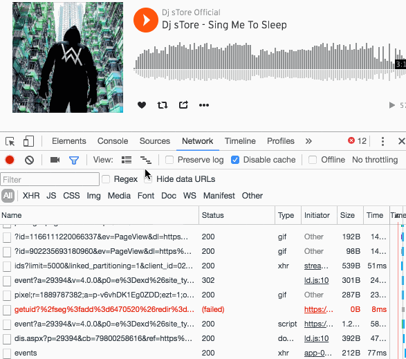

[Soundcloud](https://soundcloud.com/), per chi non lo conoscesse, è un ottimo sito web che permette ai musicisti di collaborare, promuovere e distribuire la loro musica.

Purtroppo non permette lo scaricamento delle canzoni, ma utilizzando gli [strumenti per sviluppatori](https://support.google.com/dfp_premium/answer/4497389?hl=it) di Google Chrome è molto semplice bypassare questa restrizione.

## Istruzioni

1. **Accedete a [Soundcloud](https://soundcloud.com/)** usando Google Chrome, e andate sulla pagina della canzone che volete scaricare.
1. **Aprite gli [strumenti per sviluppatori](https://support.google.com/dfp_premium/answer/4497389?hl=it)** premendo `F12` su Windows oppure `cmd` + `opt` + `I` su Mac. Cliccate sul tab Network. In questa sezione, cliccate sulla sesta icona a partire da sinistra. In questo modo vi si aprirà la linea del tempo dei vari scaricamenti che effettua il browser.
1. Ora siete pronti per intercettare il file `.mp3` da scaricare! **Avviate la canzone** dal browser. Appena avviata la canzone vedrete degli scaricamenti avviarsi sulla timeline, una linea sicuramente attirerà la vostra attenzione perchè sarà molto più lunga delle altre. Questa linea rappresenta proprio la canzone in formato `.mp3`.
1. **Selezionate la canzone dalla timeline**. Per farlo basta trascinare il mouse su un pezzettino della linea, vi consiglio di prendere una parte in cui questa linea è isolata così da non sbagliare la selezione.
1. Una volta selezionato lo scaricamento nella timeline, in basso vi comparirà la voce della vostra traccia. Premete con il tasto destro del mouse e cliccate su **"Apri il link in una nuova tab"**.
1. Ecco fatto! Ora avete la vostra traccia in `.mp3`! Cliccate su `File`->`Salva con nome...` e **godetevi la canzone** dove volete e quando volete!

## Video tutorial
6 passi vi sembrano troppi? Vi assicuro che dopo averci preso la mano potete scaricare quello che volete in meno di 2 secondi. Ecco qui i 6 passaggi racchiusi in un piccolo video.

Alla prossima!
