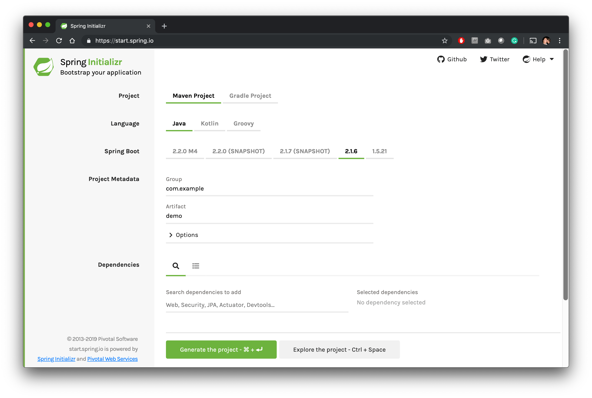
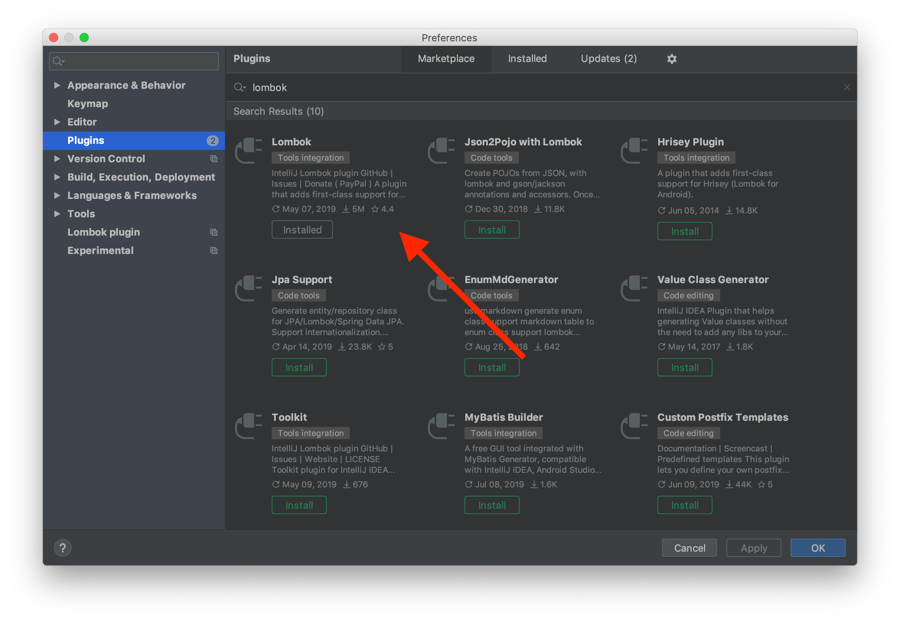
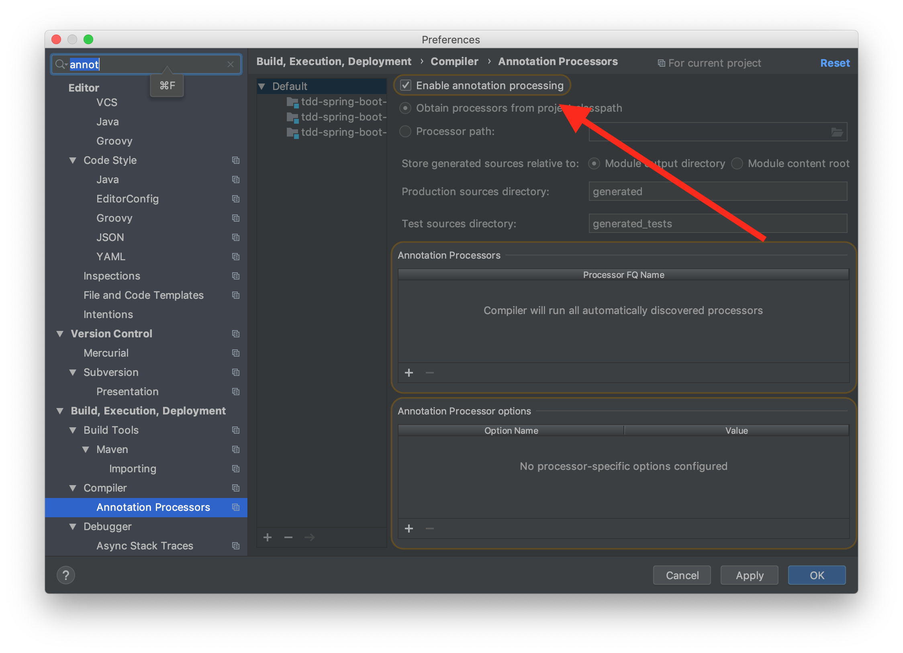
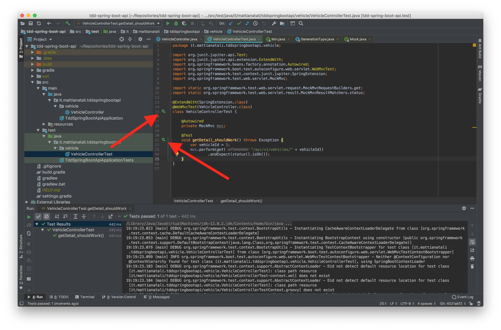

[In questo articolo](/come-sviluppare-in-test-driven-development-tdd-partendo-da-zero) abbiamo visto cosa significa sviluppare in Test Driven Development (TDD) e i pregi che ne derivano. L'esempio utilizzato potrebbe sembrare un giochino fine a se stesso, ma il mio focus lì era di spiegare il TDD per chi proprio non ne aveva mai sentito parlare.

In questa guida invece vediamo insieme un caso d'uso che ci sarà molto più familiare: lo sviluppo delle API RESTful. Per far ciò ho deciso di utilizzare il framework Spring Boot, il linguaggio scelto è Java.
Spring boot è molto utilizzato in ambito enterprise per creare un'architettura a microservizi. Anche [Netflix lo utilizza](https://hub.packtpub.com/netflix-adopts-spring-boot-as-its-core-java-framework/). Inoltre Java è un linguaggio di programmazione ormai noto a tutti e quindi penso sia una buona scelta per vedere insieme un esempio pratico.

Come sempre iniziamo completamente da zero, per non lasciare nulla al caso. Oltre al TDD, vedremo insieme anche come strutturare in modo corretto il progetto e altre librerie molto comode che uso ogni giorno per aumentare la nostra produttività, come per esempio la libreria [Lombok](https://projectlombok.org/).

## Requisiti

Il lettore che mi sto immaginando è uno **sviluppatore che ha già sentito parlare di Spring Boot, non si spaventa se parliamo di API RESTful, ha voglia di utilizzare il TDD come driver principale di sviluppo ma che non riesce ad applicarlo in modo efficace**.

Questo articolo **è una continuazione della mia [prima puntata sul TDD](/come-sviluppare-in-test-driven-development-tdd-partendo-da-zero)**, quindi vi consiglio caldamente di leggere prima ["Come sviluppare in TDD partendo da zero"](/come-sviluppare-in-test-driven-development-tdd-partendo-da-zero). Così avrete un'infarinatura iniziale sul TDD e siamo allineati su alcuni concetti che qui darò per scontato.

La mia guida si basa su un sistema operativo UNIX-like (Mac OS X), ma può essere facilmente seguito anche da chi utilizza Windows.

Sul nostro PC deve essere installato [Java Development Kit 12](https://www.oracle.com/technetwork/java/javase/downloads/jdk12-downloads-5295953.html).

## Obiettivo

Immaginiamo che dobbiamo creare due endpoint:

- `GET - /api/v1/vehicles/{id}`: per il recupero di un veicolo tramite id.
- `POST - /api/v1/vehicles`: per l'aggiunta di un veicolo.

Il veicolo è composto da queste proprietà

```json
{
  "id": 1,
  "brand": "Ferrari",
  "model": "488 GTB",
  "year": 2019
}
```

Il `brand`, `model` e `year` sono obbligatori, l'anno di produzione del veicolo non può essere antecedente al `1950` per ragioni di business.

Per ora non siamo interessati ad altri endpoint.

[Potete trovare l'implementazione di questo piccolo progetto in questa mia repository pubblica](https://github.com/matitalatina/tdd-spring-boot-api), in questo modo se vi state perdendo potete ritrovare il filo del discorso direttamente leggendo il codice.

## Creiamo il progetto

Ora che abbiamo le idee chiare su cosa dobbiamo fare, **andiamo a generare il progetto**.
Il modo migliore per farlo è andando sul sito [Spring Initializr](https://start.spring.io/). Da qui possiamo decidere quali librerie integrare, versione di Java ecc.



La configurazione che ho scelto è la seguente:

- *Project*: Gradle Project. Probabilmente avrete già sentito parlare di Maven come gestore delle dipendenze e build tool per Java. Se invece sviluppate su Android, con Gradle vi sentirete a casa, dato che è quello usato di default.
- *Language*: Java.
- *Spring Boot*: 2.1.6.
- *Project Metadata*:
  - *Group*: it.mattianatali.
  - *Artifact*: tdd-spring-boot-api.
  - *Name*: tdd-spring-boot-api.
  - *Description*: Sample project to explain how to develop APIs in TDD with Spring Boot.
  - *Package Name*: it.mattianatali.tdd-spring-boot-api.
  - *Packaging*: Jar.
  - *Java*: 12.
- *Dependencies*:
  - *Spring Web Starter*: fornisce le varie annotazioni per creare delle API RESTful in modo semplice e veloce.
  - *Lombok*: è una libreria Java che ci permette di ridurre la verbosità del nostro codice Java.
  - *Spring Data JPA*: fornisce tutto l'occorrente per la persistenza dei dati.
  - *H2 Database*: fornisce un DB in memory. In produzione sarebbe opportuno usare un DB PostgreSQL o MySQL, ma per non perderci troppo nella configurazione del DB, ho preferito usare H2.

Premiamo "Generate the project". Ci ritroviamo un bel file zip. Scompattiamo in una cartella a nostro piacimento.
Apriamo il progetto, io utilizzo IntelliJ.

### Abilitiamo lombok e l'annotation processor in IntelliJ

Se è la prima volta che usate [Lombok](https://projectlombok.org/), **avete bisogno del Plugin "Lombok"**. Aprite "Preferences", andate su "Plugins", cercate "Lombok" sul marketplace e installatelo.



Una volta aperto il progetto in IntelliJ, **dobbiamo abilitare l'annotation processor**. Per fare questo aprite "Preferences", cercate "annotation" e spuntate l'opzione "Enable annotation processing".



### Carichiamo JUnit 5

Purtroppo la dipendenza per i test `org.springframework.boot:spring-boot-starter-test`, che possiamo trovare nel file `build.gradle`, utilizza ancora JUnit 4. Siccome più avanti utilizzeremo delle funzionalità avanzate, abbiamo bisogno di **JUnit 5**.

Per raggiungere l'obiettivo, aggiungiamo nel file `build.gradle` le dipendenze per JUnit 5.

```groovy
dependencies {
  ...
  testImplementation 'org.junit.jupiter:junit-jupiter-api'
  testRuntimeOnly 'org.junit.jupiter:junit-jupiter-engine'
  testImplementation 'org.junit.jupiter:junit-jupiter-params'
  testImplementation 'org.mockito:mockito-junit-jupiter'
}
```

Infine ci serve "avvisare" Gradle di utilizzare JUnit 5 durante il comando di test `./gradlew test` e di mostrare i log completi. Così ci è più semplice debuggare in caso di problemi.
Sempre nel file `build.gradle` aggiungiamo in fondo

```groovy
test {
 useJUnitPlatform()
 testLogging {
  exceptionFormat = 'full'
 }
}
```

Nel nostro progetto, c'è già un file di test scritto in JUnit 4. Il file si trova in `src/test/java/it/mattianatali/tddspringbootapi/TddSpringBootApiApplicationTests.java`. Questo test prova semplicemente a caricare il contesto di Spring. Può sembrare un test banale, ma a mano a mano che il progetto cresce, basta poco per dimenticarsi qualche annotazione e che quindi Spring non si carichi correttamente.

Il nostro primo passo è di **migrarlo a JUnit 5**

Dovrebbe essere scritto così:

```java
package it.mattianatali.tddspringbootapi;

import org.junit.Test;
import org.junit.runner.RunWith;
import org.springframework.boot.test.context.SpringBootTest;
import org.springframework.test.context.junit4.SpringRunner;

@RunWith(SpringRunner.class)
@SpringBootTest
public class TddSpringBootApiApplicationTests {

	@Test
	public void contextLoads() {
	}

}
```

Noi lo modifichiamo così:

```java
package it.mattianatali.tddspringbootapi;

import org.junit.jupiter.api.Test;
import org.junit.jupiter.api.extension.ExtendWith;
import org.springframework.boot.test.context.SpringBootTest;
import org.springframework.test.context.junit.jupiter.SpringExtension;

@ExtendWith(SpringExtension.class)
@SpringBootTest
class TddSpringBootApiApplicationTests {

	@Test
	void contextLoads() {
	}

}
```

Avete notato delle differenze? Per migrare un test da JUnit 4 a JUnit 5 bisogna stare attenti a queste cose:

- Modificare l'annotazione `@RunWith(SpringRunner.class)` con `@ExtendWith(SpringExtension.class)`.
- Essere certi di avere **sempre** la scritta `junit.jupiter` nell'`import` di tutte le classi di JUnit. Infatti Se leggete `jupiter` significa che state usando JUnit 5. Possiamo notare che l'annotazione `@Test` ha cambiato package... Ricordatevi dovete usare `junit.jupiter`!
- Le classi di test e i metodi non devono essere necessariamente `public`. Se usate IntelliJ si lamenterà di questo fatto.

Ora proviamo a vedere se la nostra suite di test è configurata correttamente. Per far ciò creiamo un test temporaneo che sicuramente fallisce.

```java
...
import static org.junit.jupiter.api.Assertions.fail;
...
class TddSpringBootApiApplicationTests {
  ...

  @Test
	public void shouldFail() {
        fail("You shall not pass!");
	}
}
```

I puntini di sospensione `...` nel codice significa che c'è altro nel file che però non ho scritto per evitare distrazioni.

Proviamo a far girare i test: utiliziamo IntelliJ oppure Gradle con il comando `./gradlew test`.
Ci aspettiamo che un test passi e l'altro fallisca.

L'output del test è il seguente

```bash

> Task :test FAILED

it.mattianatali.tddspringbootapi.TddSpringBootApiApplicationTests > shouldFail() FAILED
    org.opentest4j.AssertionFailedError: You shall not pass!
        at org.junit.jupiter.api.AssertionUtils.fail(AssertionUtils.java:38)
        at org.junit.jupiter.api.Assertions.fail(Assertions.java:84)
        at it.mattianatali.tddspringbootapi.TddSpringBootApiApplicationTests.shouldFail(TddSpringBootApiApplicationTests.java:20)
2019-07-20 12:56:43.465  INFO 13515 --- [       Thread-4] o.s.s.concurrent.ThreadPoolTaskExecutor  : Shutting down ExecutorService 'applicationTaskExecutor'
2019-07-20 12:56:43.466  INFO 13515 --- [       Thread-4] j.LocalContainerEntityManagerFactoryBean : Closing JPA EntityManagerFactory for persistence unit 'default'
2019-07-20 12:56:43.466  INFO 13515 --- [       Thread-4] .SchemaDropperImpl$DelayedDropActionImpl : HHH000477: Starting delayed evictData of schema as part of SessionFactory shut-down'
2019-07-20 12:56:43.468  INFO 13515 --- [       Thread-4] com.zaxxer.hikari.HikariDataSource       : HikariPool-1 - Shutdown initiated...
2019-07-20 12:56:43.472  INFO 13515 --- [       Thread-4] com.zaxxer.hikari.HikariDataSource       : HikariPool-1 - Shutdown completed.

2 tests completed, 1 failed

FAILURE: Build failed with an exception.

* What went wrong:
Execution failed for task ':test'.
> There were failing tests. See the report at: file:///Users/mattia/Repositories/tdd-spring-boot-api/build/reports/tests/test/index.html

* Try:
Run with --stacktrace option to get the stack trace. Run with --info or --debug option to get more log output. Run with --scan to get full insights.

* Get more help at https://help.gradle.org

BUILD FAILED in 5s
4 actionable tasks: 2 executed, 2 up-to-date
```

È proprio quello che ci aspettavamo! Ora **togliamo il test che fallisce** e possiamo essere certi che JUnit 5 è configurato alla perfezione!

## Come strutturare il backend

Prima di iniziare a scrivere il codice dobbiamo essere allineati su come andremo ad architettare il nostro software.
Solitamente, il minimo indispensabile per creare un backend che espone delle API RESTful è implementare tre tipi di classi:

- **Controller**: il suo unico scopo è di validare i valori in input, dichiarare gli endpoint che vogliamo esporre, di invocare un service e di fornire la risposta data dalla classe service.
- **Service**: al suo interno abbiamo la vera logica di business che dipende dal progetto, fa il lavoro sporco e se deve persistere qualche dato, invoca i repository.
- **Repository**: esiste per persistere i dati da qualche parte, solitamente in un DB.

Ovviamente si può fare tutto in una classe, ma **se vogliamo strutturare del buon codice testabile e riusabile, questo è il minimo**. Dobbiamo sempre ricordarci che più una classe ha uno scopo ben preciso, più è semplice da implementare ma soprattutto è facile da riutilizzare in altri punti.

## Implementiamo la chiamata GET

Iniziamo! La chiamata `GET - /api/v1/vehicles/{id}` abbiamo detto che deve fornire il dettaglio del veicolo. Per sviluppare immagino di essere la richiesta HTTP. La prima classe che viene intaccata dalla chiamata è il controller, come abbiamo detto la sua funzione è quella di validare i valori di input e di esporre l'endpoint che andiamo a chiamare.
Andiamo a creare il controller. Creiamo il file `src/main/java/it/mattianatali/tddspringbootapi/vehicle/VehicleController.java`.

```java
package it.mattianatali.tddspringbootapi.vehicle;

public class VehicleController {
}
```

Per ora ci basta questo, stiamo sviluppando in TDD quindi **la nostra implementazione deve essere guidata dai test**. Con IntelliJ possiamo premere `cmd` + `shift` + `T`, selezionare "Create New Test..." e confermare. In questo modo ci troviamo il file di test creato ad hoc per il nostro controller.

Pensiamo ora cosa deve fare il nostro controller per raggiungere l'obiettivo:

- Dichiarare che esiste l'endpoint `GET - /api/v1/vehicles/{id}`.
- Ricevere l'id del veicolo dal path della chiamata.
- Chiamare il servizio `VehicleService`, che non esiste ancora, con l'id preso dal punto precedente.
- Se `VehicleService` restituisce un veicolo, allora risponde con un `200 - Ok` come `statusCode` e il veicolo nel body, altrimenti risponde con un bel `404 - Not Found`.

### Versione Semplificata

Siccome siamo alle prime armi con il TDD, è veramente difficile fare un test così completo al primo tentativo.
Cerchiamo allora di procedere per piccoli passi. **Testiamo una versione semplificata**.

Il nostro primo test verificherà solo questo, poi pian piano aggiungiamo i punti rimanenti:

- Verificare che esiste l'endpoint `GET - /api/v1/vehicles/{id}`.
- Restituisce come statusCode `200 - Ok`.

Il nostro test è il seguente:

```java
package it.mattianatali.tddspringbootapi.vehicle;

import org.junit.jupiter.api.Test;
import org.junit.jupiter.api.extension.ExtendWith;
import org.springframework.beans.factory.annotation.Autowired;
import org.springframework.boot.test.autoconfigure.web.servlet.WebMvcTest;
import org.springframework.test.context.junit.jupiter.SpringExtension;
import org.springframework.test.web.servlet.MockMvc;

import static org.springframework.test.web.servlet.request.MockMvcRequestBuilders.get;
import static org.springframework.test.web.servlet.result.MockMvcResultMatchers.status;

@ExtendWith(SpringExtension.class)
@WebMvcTest(VehicleController.class)
class VehicleControllerTest {

    @Autowired
    private MockMvc mvc;

    @Test
    void getDetail_shouldReturn200() throws Exception {
        var vehicleId = 1;
        mvc.perform(get("/api/v1/vehicles/" + vehicleId))
                .andExpect(status().isOk());
    }
}
```

Ora spieghiamo punto per punto le cose nuove che non abbiamo mai visto:

- `@ExtendWith(SpringExtension.class)` serve per collegare il contesto di JUnit con il framework di Spring Boot. In questo modo possiamo usare le annotazioni che comunemente usiamo con Spring Boot più altre annotazioni che esistono apposta per semplificare la vita durante il testing, come la successiva.
- `@WebMvcTest(VehicleController.class)` è il nostro modo per dire a JUnit 5 + Spring Boot: "Voglio testare solo la parte adibita al controller `VehicleController`, quindi evita di caricare tutto il contesto di Spring Boot". In altre parole il nostro test si avvierà più velocemente perché il nostro test sa bene che non deve caricare per esempio [Hibernate](https://hibernate.org/), caricare i drivers del DB, configurazioni, servizi, repositories o altre cose, perché non ne abbiamo bisogno. Stiamo testando solo quel controller. Se invece vogliamo testare qualcosa caricando tutto il contesto di Spring Boot possiamo usare l'annotazione `@SpringBootTest`. Ma è sempre meglio evitare per non rallentare il caricamente ed esecuzione dei test.
- `@Autowired private MockMvc mvc` significa "Spring Boot: forniscimi un modo per comunicare con il controller che ho definito nell'annotazione precedente (`VehicleController`), che mi permetta di fare delle chiamate HTTP". `@Autowired` significa che è Spring Boot a fornircelo, non dobbiamo preoccuparci come lo istanzia per noi. `MockMvc mvc` è l'istanza fornita da Spring Boot che useremo per fare le chiamate HTTP.

Io solitamente adotto questa convenzione per i nomi dei test: `nomeMetodo_cosaStiamoTestando`. Non preoccupatevi di scrivere un nome troppo lungo, non andrete mai a riscrivere il nome del metodo. Qui **è importante essere chiarissimi su cosa stiamo testando e cosa ci aspettiamo**. Ogni volta che programmate mettetevi nei panni di un altro sviluppatore che non sa nulla di quello che state facendo, **cercate di semplificare la vita al prossimo**: in questo caso più siamo chiari, più i nostri colleghi saranno felici del nostro lavoro.

- `mvc.perform(get("api/v1/vehicles/" + vehicleId))` è il nostro modo per fare una chiamata `GET` all'endpoint che stiamo testando.
- `.andExpect(status().isOk())` è la nostra asserzione sullo `statusCode` della nostra chiamata HTTP, ci aspettiamo un bel `200 - Ok`. 

Facciamo girare il test, ci aspettiamo che fallisca e che invece dello `statusCode` `200` ci restituisca un `404 - Not Found`, perché l'endpoint non è stato ancora dichiarato. Con IntelliJ è molto facile testare un singolo test, basta premere sulla freccia verde vicino al nome del metodo.



Questo è il risultato del nostro test:

```bash
2019-07-20 16:33:15.748  WARN 14736 --- [    Test worker] o.s.web.servlet.PageNotFound             : No mapping for GET api/v1/vehicles/1

...
Status expected:<200> but was:<404>
Expected :200
Actual   :404
<Click to see difference>

java.lang.AssertionError: Status expected:<200> but was:<404>
	...
```

Esattamente come ci aspettavamo.

Ora andiamo ad implementare il minimo indispensabile per far passare il test. Scriviamo in `VehicleController`

```java
package it.mattianatali.tddspringbootapi.vehicle;

import org.springframework.web.bind.annotation.GetMapping;
import org.springframework.web.bind.annotation.PathVariable;
import org.springframework.web.bind.annotation.RestController;

@RestController
public class VehicleController {
    @GetMapping("/api/v1/vehicles/{id}")
    void getVehicleDetails(@PathVariable Long id) {

    }
}
```

- `@RestController` è l'annotazione di Spring Boot che serve per dichiarare che stiamo creando un Controller.
- `@GetMapping("/api/v1/vehicles/{id}")` dichiariamo l'esistenza del nostro endpoint con il metodo `GET` e che ha una variabile nel path chiamata `id`.
- `@PathVariable Long id` serve per estrapolare l'id dal path.

Come possiamo notare non restituiamo nulla dall'endpoint... Infatti non abbiamo messo nessuna asserzione nel test, quindi non è necessario mettere altro. Per ora vogliamo solo testare che risponda con `statusCode` `200`. Che è il valore di default se non inseriamo niente.

Facciamo girare il test, aspettiamo qualche secondo, e stavolta è verde! Possiamo facilmente intuire che il nostro test non è sufficiente, ora miglioriamolo in modo tale da testare almeno "l'happy path" completo.

### Versione Completa

Modifichiamo il test rendendolo completo:

```java
package it.mattianatali.tddspringbootapi.vehicle;

import org.junit.jupiter.api.Test;
import org.junit.jupiter.api.extension.ExtendWith;
import org.springframework.beans.factory.annotation.Autowired;
import org.springframework.boot.test.autoconfigure.web.servlet.WebMvcTest;
import org.springframework.boot.test.mock.mockito.MockBean;
import org.springframework.test.context.junit.jupiter.SpringExtension;
import org.springframework.test.web.servlet.MockMvc;

import java.util.Optional;

import static org.hamcrest.Matchers.is;
import static org.mockito.Mockito.when;
import static org.springframework.test.web.servlet.request.MockMvcRequestBuilders.get;
import static org.springframework.test.web.servlet.result.MockMvcResultMatchers.jsonPath;
import static org.springframework.test.web.servlet.result.MockMvcResultMatchers.status;

@ExtendWith(SpringExtension.class)
@WebMvcTest(VehicleController.class)
class VehicleControllerTest {

    @Autowired
    private MockMvc mvc;

    @MockBean
    private VehicleService vehicleService;

    @Test
    void getDetail_shouldReturnVehicleIfFound() throws Exception {
        var vehicleId = 1L;
        var returnedVehicle = Vehicle.builder()
                .id(vehicleId)
                .brand("Ferrari")
                .model("488 GTB")
                .year(2019)
                .build();

        when(vehicleService.get(vehicleId)).thenReturn(Optional.of(returnedVehicle));

        mvc.perform(get("/api/v1/vehicles/" + vehicleId))
                .andExpect(status().isOk())
                .andExpect(jsonPath("$.id", is(returnedVehicle.getId().intValue())))
                .andExpect(jsonPath("$.brand", is(returnedVehicle.getBrand())))
                .andExpect(jsonPath("$.model", is(returnedVehicle.getModel())))
                .andExpect(jsonPath("$.year", is(returnedVehicle.getYear())));
    }
}

```

In questo momento c'è il nostro compilatore che si sta disperando perché non trova `VehicleService` e nemmeno la classe `Vehicle`... Infatti non li abbiamo ancora creati!

Anche in questo caso vediamo cosa c'è di nuovo:

- `@MockBean private VehicleService vehicleService` stiamo dicendo a Spring Boot: "Se qualche classe ti chiede il servizio `VehicleService`, tu non passare la vera implementazione, ma fornisci un'istanza finta, dove io posso decidere cosa ritornare nell'invocazione dei metodi". Infatti più avanti con il metodo `when` possiamo decidere cosa ritornare come valore, senza andare a richiamare la vera implementazione. Il discorso di cosa vuol dire "Mockare" le classi è già stato trattato nel mio articolo precedente, se non vi è chiaro è meglio che [leggiate la puntata precedente](/come-sviluppare-in-test-driven-development-tdd-partendo-da-zero).
- `var returnedVehicle = Vehicle.builder()....build()` stiamo semplicemente creando un modello di veicolo che verrà restituito in output dal `VehicleService` e di conseguenza dal controller. In questo caso useremo il builder che ci fornisce Lombok, non preoccupatevi per ora, quando creeremo la classe sarà più chiaro.
- `when(vehicleService.get(vehicleId)).thenReturn(Optional.of(returnedVehicle));` stiamo dicendo "se qualcuno invoca `vehicleService.get` con l'id `vehicleId`, allora ritorna un opzionale con il nostro veicolo appena creato".
- `.andExpect(jsonPath("$.id", is(returnedVehicle.getId())))` significa che ci aspettiamo nel body di risposta un JSON che contiene un campo `id`, con dentro l'id del nostro veicolo creato. Le altre righe sono molto simili, cambia solo il campo che andiamo a controllare.

Non possiamo far girare i test perché il codice non compila nemmeno. Andiamo allora a creare le classi mancanti. Con IntellJ è molto semplice creare classi o metodi che non esistono ancora, basta spostare il cursore sulla classe inesistente, premere `alt` + `Invio`, cliccare su "*Create class ...*", come target directory scegliere `main` e non `test`, e confermate.

Facciamo questo procedimento con `Vehicle`. Poi implementiamola.
Il file dovrebbe trovarsi in `/src/main/java/it/mattianatali/tddspringbootapi/vehicle/Vehicle.java`

```java
package it.mattianatali.tddspringbootapi.vehicle;

import lombok.Builder;
import lombok.Data;

@Data
@NoArgsConstructor
@AllArgsConstructor
@Builder(toBuilder = true)
public class Vehicle {
    private Long id;
    private String brand;
    private String model;
    private Integer year;
}
```

Qui possiamo vedere Lombok in azione! Grazie all'annotazione `@Data` non dobbiamo scrivere né getter, né setter, né fare l'override di equals o hash, fa tutto lui! Con `@Builder(toBuilder = true)` invece ci viene gratis un comodo builder che abbiamo già usato nel test. `toBuilder = true` ci fornisce un comodo metodo sull'istanza che ci permette di avere un builder dall'istanza stessa, molto comodo per creare per esempio un clone modificando magari qualche suo campo.
`@NoArgsConstructor` e `@AllArgsConstructor` sono ancora due annotazioni di Lombok che ci forniscono sia il costruttore con tutti i parametri, sia il costruttore vuoto. Sono molto utili per la serializzazione delle istanze in JSON. Se infatti non mettiamo queste due annotazioni, [Jackson](https://github.com/FasterXML/jackson), che è la libreria che utilizza Spring Boot per creare i JSON di risposta, si lamenterà perché non riesce a serializzare l'oggetto.
Meno codice da scrivere significa meno codice da gestire e testare!

Ora dobbiamo creare il `VehicleService`. In questo caso **scriviamo il minimo indispensabile per poter compilare**, ci dobbiamo ricordare che **nel test usiamo la versione mockata, quindi la vera implementazione ora non ci interessa**. Ci preoccuperemo quando andremo a sviluppare in TDD su di essa. Anche qui possiamo farci aiutare da IntelliJ.

Una volta creata la classe, possiamo dire ad IntelliJ di creare il metodo `VehicleService.get` che abbiamo invocato nella riga di test `when(vehicleService.get(vehicleId))`. `alt` + `invio` è il nostro migliore amico in questo caso.

Il file `src/main/java/it/mattianatali/tddspringbootapi/vehicle/VehicleService.java` conterrà quindi

```java
package it.mattianatali.tddspringbootapi.vehicle;

import org.springframework.stereotype.Service;

import java.util.Optional;

@Service
public class VehicleService {
    public Optional<Vehicle> get(long vehicleId) {
        return null;
    }
}

```

- `@Service` serve a dire che la classe è un servizio e che può essere creata da Spring Boot tramite la *Dependency Injection (DI)* e che può essere iniettata nelle altre classi quando usano l'annotazione `@Autowired`.

Il metodo è ovviamente sbagliato, ma ripeto, ora ci interessa solo che compili in modo tale da far girare i test.

Qui c'è una cosa molto interessante da notare: **abbiamo definito prima la *firma* del metodo prima di pensare alla sua attuale implementazione**. In questo molto **definiamo le classi dal punto di vista dell'*utilizzatore* e non del *creatore***. Solitamente questo è un bene perché si creano delle firme dei metodi facilmente utilizzabili. Se invertiamo il procedimento finiamo di semplificare l'implementazione ma rendiamo difficile l'utilizzo delle classi create perché appunto non pensiamo a come un possibile utilizzatore possa sfruttare queste classi.

Facendo girare il test abbiamo il seguente errore

```java
...
java.lang.AssertionError: No value at JSON path "$.id"
...
Caused by: java.lang.IllegalArgumentException: json can not be null or empty
...
```

Ora si sta lamentando che il nostro endpoint non restituisce nessun JSON e che quindi non può testare le varie proprietà.
Perfetto, andiamo ad implementare per far passare il test.

Modifichiamo il nostro `VehicleController`

```java
package it.mattianatali.tddspringbootapi.vehicle;

import org.springframework.beans.factory.annotation.Autowired;
import org.springframework.web.bind.annotation.GetMapping;
import org.springframework.web.bind.annotation.PathVariable;
import org.springframework.web.bind.annotation.RestController;

@RestController
public class VehicleController {
    private VehicleService vehicleService;

    @Autowired
    public VehicleController(VehicleService vehicleService) {
        this.vehicleService = vehicleService;
    }

    @GetMapping("/api/v1/vehicles/{id}")
    Vehicle getVehicleDetails(@PathVariable Long id) {
        return vehicleService.get(id).get();
    }
}
```

**Possiamo vedere per la prima volta come si può sfruttare la [Dependency Injection](https://en.wikipedia.org/wiki/Dependency_injection) di Spring Boot**. Possiamo chiedere a Spring Boot di fornirci delle istanze di classi che ci servono per svolgere il nostro compito (in questo caso il recupero del veicolo), senza che noi dobbiamo preoccuparci effettivamente di *come* queste istanze siano create. In altre parole, tramite l'annotazione `@Autowired` stiamo dicendo a Spring Boot di fornirci nel costruttore tutte le istanze che abbiamo bisogno, delegando al framework il come crearle.

In questo modo possiamo creare delle classi disaccoppiate tra di loro e soprattutto nei test possiamo *iniettare* delle istanze finte (mockate). Iniettando nei test delle classi mockate possiamo pilotare il flusso di esecuzione senza distogliere lo sguardo dalla classe sotto test. Perché infatti l'unica vera implementazione testata è il controller, il resto è tutta finzione (la finzione è data dall'annotazione `@MockBean` e dal metodo `when().thenReturn()`).

Dobbiamo infatti immaginare che durante il test, il controller riceve la nostra istanza mockata nel costruttore, quindi non va a toccare la vera implementazione di `VehicleService` (che per ora non esiste ancora... ritorna sempre `null`!).

Magari vi state chiedendo perché c'è un doppio `get` in `vehicleService.get(id).get()`. Il primo è l'invocazione del nostro metodo di `VehicleService`, il secondo serve per estrapolare il valore contenuto in `Optional<Vehicle>`. **È fortemente sconsigliato chiamare `get` su un opzionale** perché non stiamo gestendo il caso in cui l'opzionale sia vuoto, in altre parole quando il veicolo non esiste. Ma per ora il nostro obiettivo è di far passare il test, poi **quando faremo il test che testa il caso in cui il veicolo non esiste, lo sistemeremo**.

Facendo girare il test vediamo che effettivamente funziona! Ritorniamo il JSON con tutti i campi.

### Testiamo il caso di assenza veicolo

Abbiamo testato quando il veicolo viene ritornato dal `VehicleService`, ma cosa succede quando il veicolo con un determinato id non esiste? Noi ci aspettiamo che l'endpoint ritorni `404 - Not Found`.

Andiamo a creare il test che verifica questo caso, nel `VehicleControllerTest` scriviamo:

```java
@Test
void getDetail_shouldReturn404IfVehicleNotFound() throws Exception {
    var vehicleId = 1L;

    when(vehicleService.get(vehicleId)).thenReturn(Optional.empty());

    mvc.perform(get("/api/v1/vehicles/" + vehicleId))
            .andExpect(status().isNotFound());
}
```

Facendo girare il test esplode in questo modo

```bash

org.springframework.web.util.NestedServletException: Request processing failed; nested exception is java.util.NoSuchElementException: No value present

	...
Caused by: java.util.NoSuchElementException: No value present
  ...
	... 57 more
```

In pratica è il nostro famoso `get` sull'opzionale che abbiamo messo nel controller. Stiamo cercando di recuperare un dato che non esiste e quindi va in eccezione.

Andiamo a modificare il controller in modo tale che ci restituisca uno status code `404 - Not Found` quando il servizio non ci restituisce alcun veicolo.
Per rispondere `404` abbiamo bisogno di un'eccezione che ci generi quello status code.
Quindi creiamo l'eccezione in  `src/main/java/it/mattianatali/tddspringbootapi/vehicle/errors/VehicleNotFoundException.java` e scriviamo

```java
package it.mattianatali.tddspringbootapi.vehicle.errors;

import org.springframework.http.HttpStatus;
import org.springframework.web.bind.annotation.ResponseStatus;

@ResponseStatus(HttpStatus.NOT_FOUND)
public class VehicleNotFoundException extends RuntimeException {
}
```

Grazie a `@ResponseStatus(HttpStatus.NOT_FOUND)` siamo sicuri che lo status code della chiamata sarà `404 - Not Found`.

Ora modifichiamo il metodo `VehicleController.getVehicleDetails` utilizzando questa nuova eccezione

```java
@GetMapping("/api/v1/vehicles/{id}")
Vehicle getVehicleDetails(@PathVariable Long id) {
    return vehicleService
            .get(id)
            .orElseThrow(VehicleNotFoundException::new);
}
```

In pratica abbiamo sostituito il metodo `.get` con `.orElseThrow(VehicleNotFoundException::new)`. Questo è il modo per generare un'eccezione in caso di mancato valore nell'opzionale.

Facciamo girare il test ed ora funziona tutto!

### Ricapitoliamo

Fermiamoci un secondo per fare mente locale. Il lavoro per ultimare l'endpoint GET non è ancora concluso. Però ora è importante focalizzare cosa abbiamo imparato e fatto fino ad ora:

- Abbiamo creato un nuovo progetto Spring Boot utilizzando [Spring Initializr](https://start.spring.io/).
- Abbiamo migrato la suite di test a [JUnit 5](https://junit.org/junit5/).
- Abbiamo imparato ad utilizzare alcune funzionalità di [Lombok](https://projectlombok.org/).
- Abbiamo sviluppato in TDD il controller per la chiamata `GET`.
- Abbiamo imparato a sfruttare la [Dependency Injection](https://en.wikipedia.org/wiki/Dependency_injection) e l'annotazione `@Autowired` di Spring Boot per testare in isolamento il controller, ancor prima di aver implementato il servizio `VehicleService`.
- Abbiamo imparato a fare delle finte chiamate HTTP utilizzando `@WebMvcTest`.

Prendiamoci una pausa, tutti i concetti appena esposti hanno bisogno di un attimo per essere assimilati. Poi continuiamo a sviluppare i due componenti rimanenti: il servizio `VehicleService` e il repository `VehicleRepository`.

### Implementiamo il servizio VehicleService

Ora che ci siamo rigenerati un attimo, svolgiamo un lavoro abbastanza semplice: l'implementazione di `VehicleService`. In questa classe ci dovrebbe andare tutta la logica di business, ma la logica che ha la chiamata GET è davvero banale: recuperare il veicolo dato il suo id. Non preoccupatevi, nei progetti veri la logica di business diventa sempre complessa a piacere. Noi siamo solo fortunati perché siamo all'inizio.
In altre parole, nel nostro caso dobbiamo testare che venga invocato il `VehicleRepository` per recuperare il veicolo, il valore di ritorno deve essere esattamente lo stesso che otteniamo dal `VehicleRepository`. `VehicleRepository` non esiste ancora e quindi dobbiamo pensare al metodo che fa al caso nostro. Non reinventiamo niente e quindi immaginiamo di utilizzare il metodo `VehicleRepository.findById(Long id)` che ci fornice gratis [JpaRepository](https://docs.spring.io/spring-data/jpa/docs/1.5.0.RELEASE/reference/html/jpa.repositories.html).

Scriviamo i test nel nuovo file `src/test/java/it/mattianatali/tddspringbootapi/vehicle/VehicleServiceTest.java`:

```java
package it.mattianatali.tddspringbootapi.vehicle;

import org.junit.jupiter.api.Test;
import org.junit.jupiter.api.extension.ExtendWith;
import org.mockito.InjectMocks;
import org.mockito.Mock;
import org.mockito.junit.jupiter.MockitoExtension;

import java.util.Optional;

import static org.junit.jupiter.api.Assertions.assertEquals;
import static org.junit.jupiter.api.Assertions.assertTrue;
import static org.mockito.Mockito.when;

@ExtendWith(MockitoExtension.class)
class VehicleServiceTest {
    @Mock
    private VehicleRepository vehicleRepository;

    @InjectMocks
    private VehicleService vehicleService;

    @Test
    void get_shouldReturnVehicle() {
        var vehicleId = 1L;
        var returnedVehicle = Optional.of(
                Vehicle.builder()
                        .id(vehicleId)
                        .brand("Ferrari")
                        .model("488 GTB")
                        .year(2019)
                        .build()
        );
        when(vehicleRepository.findById(vehicleId))
                .thenReturn(returnedVehicle);

        assertEquals(
                returnedVehicle,
                vehicleService.get(vehicleId)
        );

    }

    @Test
    void get_shouldReturnOptionalEmptyIfNotFound() {
        var vehicleId = 1L;
        when(vehicleRepository.findById(vehicleId))
                .thenReturn(Optional.empty());

        assertTrue(vehicleService.get(vehicleId).isEmpty());
    }
}
```

Notiamo però delle diversità nelle annotazioni utilizzate, ci stiamo riferendo a

- `@ExtendWith(MockitoExtension.class)` invece di `@ExtendWith(SpringExtension.class)`.
- `@Mock` invece di `@MockBean`.
- `@InjectMocks` è nuovo.

Perché abbiamo queste differenze rispetto al nostro test sul controller? Perché se ci pensiamo bene **non abbiamo bisogno di caricare nessun componente di Spring Boot** (nel controller avevamo bisogno di `MockMvc` di Spring Boot per simulare delle chiamate HTTP), quindi possiamo utilizzare solo la libreria [Mockito](https://site.mockito.org/) per testare il nostro servizio. Questo **significa avere dei test più veloci** ad avviarsi perché non dobbiamo caricare il contesto di Spring Boot. Le annotazioni per usare Mockito sono appunto

- `@ExtendWith(MockitoExtension.class)` per avviare il contesto di Mockito e le sue annotazioni durante il test.
- `@Mock` per creare un'istanza mockata che possiamo decidere le risposte da dare, attraverso il metodo `when(...).thenReturn(...)` durante i test.
- `@InjectMocks` per iniettare le istanze mockate nel nostro servizio sotto test (nel nostro caso `VehicleService`).

Il resto non dovrebbe sorprendervi più di tanto, normalissimi test organizzati in *setup*, *call*, *assertions*.

Siccome il compilatore si sta lamentando che `VehicleRepository` non esiste, andiamo a crearlo senza implementare il metodo. In modo tale da poter eseguire il test del `VehicleService`.
In `src/main/java/it/mattianatali/tddspringbootapi/vehicle/VehicleRepository.java` scriviamo:

```java
package it.mattianatali.tddspringbootapi.vehicle;

import org.springframework.stereotype.Repository;

import java.util.Optional;

@Repository
public class VehicleRepository {
    public Optional<Vehicle> findById(long vehicleId) {
        return null;
    }
}
```

Ora compila! Facciamo girare i test del nostro servizio ed ovviamente falliscono.
Andiamo ad implementare il servizio che sarà molto semplice, non fa nient'altro che fare da "proxy" al nostro futuro `VehicleRepository`.

```java
package it.mattianatali.tddspringbootapi.vehicle;

import org.springframework.beans.factory.annotation.Autowired;
import org.springframework.stereotype.Service;

import java.util.Optional;

@Service
public class VehicleService {
    private VehicleRepository vehicleRepository;

    @Autowired
    public VehicleService(VehicleRepository vehicleRepository) {
        this.vehicleRepository = vehicleRepository;
    }

    public Optional<Vehicle> get(long vehicleId) {
        return vehicleRepository.findById(vehicleId);
    }
}
```

Anche qui niente di eccezionale. Prendiamo `VehicleRepository` tramite DI nel costruttore e lo utilizziamo per fornire il veicolo nella chiamata `get`.
Facciamo girare i test e sono verdi!

### Implementiamo il VehicleRepository

Siamo quasi giunti al termine, ci manca solo il `VehicleRepository` per ultimare la chiamata `GET`.
Qui abbiamo bisogno di testare il metodo `findById` per recuperare il veicolo, per fare un test completo dobbiamo anche poter salvare un veicolo prima di recuperarlo.

Scriviamo il test in `src/test/java/it/mattianatali/tddspringbootapi/vehicle/VehicleRepositoryTest.java`

```java
package it.mattianatali.tddspringbootapi.vehicle;

import org.junit.jupiter.api.Test;
import org.junit.jupiter.api.extension.ExtendWith;
import org.springframework.beans.factory.annotation.Autowired;
import org.springframework.boot.test.autoconfigure.orm.jpa.DataJpaTest;
import org.springframework.test.context.junit.jupiter.SpringExtension;

import java.util.Optional;

import static org.junit.jupiter.api.Assertions.assertEquals;

@ExtendWith(SpringExtension.class)
@DataJpaTest
class VehicleRepositoryTest {
    @Autowired
    private VehicleRepository vehicleRepository;

    @Test
    void findById_shouldGetVehicle() {
        var vehicleToSave =
                Vehicle.builder()
                        .brand("Ferrari")
                        .model("488 GTB")
                        .year(2019)
                        .build();
        var expectedVehicle = vehicleRepository.save(vehicleToSave);
        assertEquals(
                Optional.of(expectedVehicle),
                vehicleRepository.findById(expectedVehicle.getId())
        );
    }
}
```

Con questo test salviamo un veicolo, poi lo recuperiamo con l'id che ci viene restituito nella `save` e poi verifichiamo che il `findById` ci restituisca il veicolo.
Ma vediamo le annotazioni che abbiamo utilizzato: sono praticamente le stesse che abbiamo utilizzato per il controller, ma stavolta invece di `@WebMvcTest` abbiamo utilizzato `@DataJpaTest` che serve per testare la persistenza dei dati. Abbiamo bisogno di usare il contesto di Spring Boot perché JPA lo richiede, di conseguenza non possiamo usare solamente Mockito come abbiamo fatto con `VehicleService`.

Anche in questo caso non compila, perché non abbiamo il metodo `save` dichiarato in `VehicleRepository`. Andiamo a sistemare in modo intelligente la questione. Trasformiamo `VehicleRepository` in questo modo:

```java
package it.mattianatali.tddspringbootapi.vehicle;

import org.springframework.data.repository.CrudRepository;
import org.springframework.stereotype.Repository;

@Repository
public interface VehicleRepository extends CrudRepository<Vehicle, Long> {
}
```

Abbiamo trasformato il `VehicleRepository` in un'interfaccia che estende `CrudRepository`, in questo caso [utilizziamo un po' di magia offerta da JPA](https://docs.spring.io/spring-boot/docs/current/reference/htmlsingle/#boot-features-spring-data-jpa-repositories). `CrudRepository` ci offre gratis i metodi `save` e `findById` che stiamo utilizzando.

Ora compila! Proviamo ad avviare il test del Repository, ma purtroppo fallisce in questo modo:

```bash
java.lang.IllegalStateException: Failed to load ApplicationContext
	...
	at com.intellij.rt.execution.junit.JUnitStarter.main(JUnitStarter.java:70)
Caused by: org.springframework.beans.factory.BeanCreationException: Error creating bean with name 'vehicleRepository': Invocation of init method failed; nested exception is java.lang.IllegalArgumentException: Not a managed type: class it.mattianatali.tddspringbootapi.vehicle.Vehicle
	...
Caused by: java.lang.IllegalArgumentException: Not a managed type: class it.mattianatali.tddspringbootapi.vehicle.Vehicle
	...
```

Quello che Spring Boot sta cercando di dirci è che sul modello `Vehicle` mancano le annotazioni per poterlo utilizzare insieme al `CrudRepository`, infatti se ci pensiamo bene nessuno ha detto qual'è il campo id del nostro veicolo e come generarlo. Il povero JPA sa solo che esiste il modello `Vehicle` e nient'altro.

Andiamo a risolvere il problema modificando il nostro file `Vehicle`:

```java
package it.mattianatali.tddspringbootapi.vehicle;

import lombok.Builder;
import lombok.Data;

import javax.persistence.Entity;
import javax.persistence.GeneratedValue;
import javax.persistence.GenerationType;
import javax.persistence.Id;

@Data
@NoArgsConstructor
@AllArgsConstructor
@Builder(toBuilder = true)
@Entity
public class Vehicle {
    @Id
    @GeneratedValue(strategy = GenerationType.IDENTITY)
    private Long id;
    private String brand;
    private String model;
    private Integer year;
}
```

Abbiamo aggiunto tre annotazioni:

- `@Entity` serve a JPA per capire che la classe `Vehicle` può essere utilizzata come modello per la persistenza del dato sul DB.
- `@Id` stiamo indicando come id della nostra tabella sul DB il campo `Long id`.
- `@GeneratedValue(strategy = GenerationType.IDENTITY)` stiamo dicendo a JPA di delegare al DB la generazione dell'id qualora non fosse indicato.

Facciamo partire il test e stavolta funziona!

### Test in caso di mancato veicolo

Aggiungiamo un semplice test per verificare che venga restituito un `Optional.empty()` qualora non esistesse il veicolo.

```java
@Test
void findById_shouldReturnEmptyIfVehicleNotFound() {
    assertEquals(
            Optional.empty(),
            vehicleRepository.findById(999999L)
    );
}
```

Possiamo andare tranquilli che durante il test non esiste un valore con quell'id perché l'annotazione `@DataJpaTest` ci garantisce che, ogni volta che eseguiamo il test, il DB è pulito.
Eseguendolo vediamo che il test passa come ci aspettavamo, non dobbiamo implementare nient'altro.

Dobbiamo ricordarci che il setup del DB solitamente è molto più impegnativo: ci sono migrazioni, creazioni di tabelle in modo esplicito, chiamate ad un DB remoto ecc. Noi ce la stiamo cavando facilmente con il DB H2 che abbiamo inserito durante la creazione del progetto. Purtroppo non tratteremo insieme queste tematiche per non perdere il focus dal TDD.

### Test sui repository

Nel nostro caso, a causa di questa semplificazione, stiamo testando su un DB in memory creato ad hoc per i test, tutto questo grazie con l'annotazione `@DataJpaTest`. Purtroppo, cosi facendo, i test sui repository perdono la maggior parte dell'efficacia. Ma ora proviamo ad immaginare di usare questo modus operandi su un progetto vero.

Noi in Pirelli testiamo i repository su un DB molto simile a quello reale. In questo caso i vantaggi di testare i repo sono tanti, anche se l'implementazione viene fatta "magicamente" da Spring. Per esempio testando un banale `.save()` autogenerato:

- Possiamo testare che tutte le proprietà proprietà del modello siano mappate a DB.
- Possiamo verificare che le migrazioni rispecchino veramente il codice.
- Possiamo verificare che non ci siano dei typo negli enum che si mappano nel DB, o che tutti gli enum siano presenti anche lato DB.
- Possiamo verificare che il driver JDBC sia in grado di mappare tutte le proprietà presenti sul modello (e.g. driver vecchi potrebbero non mappare correttamente le classi `Date` di Java 8).
- Possiamo verificare che le relazioni vengano salvate come ci aspettiamo.

Poi il repository può crescere e possiamo creare nuovi metodi autogenerati da Spring ma anche qui:

- Possiamo testare che le relazioni siano recuperate in modo corretto.
- Possiamo verifiare che non ci siano errori logici nel metodo autogenerato (basta un attimo a confondere un id con un altro o dimenticarti un Not nel metodo).

Infine non dobbiamo trarci in inganno pensando che l'implementazione è semplice (il metodo `.save()` è autogenerato!) e quindi è inutile il test: i test guidano il nostro sviluppo in TDD. Quindi prima testiamo che la funzionalità non esista, poi la implementiamo, infine **il test verifica che esista e rimanga tale per *tutti* i prossimi sviluppi**: il metodo `.save()` può complicarsi, magari non sarà più autogenerato perchè sono state aggiunte logiche ad hoc. Il nostro test sarà sempre lì a darci questa garanzia. Se non lo facciamo all'inizio, ci perdiamo questa opportunità e potremmo avere dei dispiaceri più avanti.

### Chiamata GET completata!

Finalmente ora abbiamo la chiamata GET completamente sviluppata in TDD! Abbiamo 3 componenti ben isolati, facili da testare, con una coverage del 100%.
Sembra che sia stato lungo e difficile, ma solamente perché abbiamo spiegato ogni singola riga di codice e anche perché abbiamo spiegato ogni singolo passo che abbiamo svolto.
La buona notizia è che tramite questo processo possiamo creare qualsiasi endpoint che ci venga in mente: possiamo complicare la logica di business quanto vogliamo, ma il procedimento in TDD rimarrà sempre il medesimo.

Ora andiamo ad implementare la chiamata POST, ma spiegheremo con lo stesso livello di dettaglio solo il controller dove posso condividere con voi alcuni trucchetti che non ho ancora trattato. Lo sviluppo dei metodi nel service e del repository sarà molto simile a quello che abbiamo fatto per la chiamata GET, quindi sarebbe poco utile ripetere le stesse cose.

## Implementiamo il controller per la chiamata POST

Passiamo ora allo sviluppo della chiamata POST per creare dei nuovi veicoli. Come sempre iniziamo con i test. La prima cosa che verifichiamo è che il nostro veicolo passato nel body venga digerito correttamente da Spring Boot e che venga passato al metodo `VehicleService.save(vehicle)` per salvarlo.

```java
...

@ExtendWith(SpringExtension.class)
@WebMvcTest(VehicleController.class)
class VehicleControllerTest {
    @Autowired
    private MockMvc mvc;

    @Autowired
    private ObjectMapper objectMapper;

    @MockBean
    private VehicleService vehicleService;

    ...

    @Test
    void create_shouldSaveTheVehicle() throws Exception {
        var vehicleId = 1L;
        var vehicleToSave = aValidVehicle();

        when(vehicleService.save(vehicleToSave))
                .thenReturn(
                        vehicleToSave
                                .toBuilder()
                                .id(vehicleId)
                                .build()
                );

        mvc.perform(
                post("/api/v1/vehicles")
                .contentType(MediaType.APPLICATION_JSON)
                .content(objectMapper.writeValueAsBytes(vehicleToSave))
        )
                .andExpect(status().isCreated())
                .andExpect(jsonPath("$.id", is((int) vehicleId)))
                .andExpect(jsonPath("$.brand", is(vehicleToSave.getBrand())))
                .andExpect(jsonPath("$.model", is(vehicleToSave.getModel())))
                .andExpect(jsonPath("$.year", is(vehicleToSave.getYear())));
    }

    private static Vehicle aValidVehicle() {
        return Vehicle.builder()
                .brand("Ferrari")
                .model("488 GTB")
                .year(2019)
                .build();
    }
}
```

Come possiamo leggere, stiamo emulando una chiamata POST, settiamo correttamente il `contentType` della chiamata tramite `.contentType(MediaType.APPLICATION_JSON)` e inseriamo nel body il nostro veicolo da salvare tramite `.content(objectMapper.writeValueAsBytes(vehicleToSave))`.

Con

```java
when(vehicleService.save(vehicleToSave))
    .thenReturn(
            vehicleToSave
                    .toBuilder()
                    .id(vehicleId)
                    .build()
    );
```

emuliamo il fatto che il nostro servizio ci restituisca lo stesso oggetto passato in input ma con l'id popolato. Per questo caso abbiamo usato il metodo `toBuilder` che ci viene gentilmente offerto dall'annotazione `@Builder(toBuilder = true)` che avevamo aggiunto sulla classe `Vehicle`.

Infine testiamo che la chiamata HTTP risponda con lo statusCode `201 - Created` e che nel body abbiamo tutti i campi popolati.

`objectMapper` è il serializzatore di default di Spring Boot [Jackson](https://github.com/FasterXML/jackson). Chiediamo una sua istanza a Spring Boot tramite `@Autowired`.

Il compilatore si sta lamentando che non esiste il metodo save sul `VehicleService`, andiamo ad aggiungerlo senza implementare la logica corretta.

```java
@Service
public class VehicleService {
    private VehicleRepository vehicleRepository;

    @Autowired
    public VehicleService(VehicleRepository vehicleRepository) {
        this.vehicleRepository = vehicleRepository;
    }

    ...

    public Vehicle save(Vehicle vehicleToSave) {
        return null;
    }
}
```

Avviamo il test e fallisce per questo motivo

```bash
...
java.lang.AssertionError: Status expected:<201> but was:<404>
Expected :201
Actual   :404
<Click to see difference>
...
```

Giustamente l'endpoint non esiste ancora, quindi andiamo ad aggiungerlo sul `VehicleController`.

```java
package it.mattianatali.tddspringbootapi.vehicle;

import it.mattianatali.tddspringbootapi.vehicle.errors.VehicleNotFoundException;
import org.springframework.beans.factory.annotation.Autowired;
import org.springframework.http.HttpStatus;
import org.springframework.web.bind.annotation.*;

@RestController
public class VehicleController {
    private VehicleService vehicleService;

    @Autowired
    public VehicleController(VehicleService vehicleService) {
        this.vehicleService = vehicleService;
    }

    ...

    @PostMapping("/api/v1/vehicles")
    @ResponseStatus(HttpStatus.CREATED)
    Vehicle saveVehicle(@RequestBody Vehicle vehicle) {
        return vehicleService.save(vehicle);
    }
}
```

- `@PostMapping` è l'annotazione che ci permette di definire un'endpoint POST.
- `@ResponseStatus(HttpStatus.CREATED)` possiamo definire lo status code di risposta, di default è `200 - Ok`, noi invece vogliamo `201 - Created`.
- `@RequestBody` è l'annotazione che ci permette di prendere il valore passato nel body e di deserializzarlo a `Vehicle`.

In questo caso ci basta invocare il metodo `vehicleService.save` e di ritornare il suo valore.

Facendo girare i test è tutto ok!

Abbiamo quasi finito, ma dobbiamo ancora implementare la regola che ci è stata data quando salviamo un veicolo. La ripropongo qui:

- Il `brand`, `model` e `year` sono obbligatori, l'anno di produzione del veicolo non può essere antecedente al `1950` per ragioni di business.

Andiamo a creare il test che verifica queste condizioni.

```java
package it.mattianatali.tddspringbootapi.vehicle;

import com.fasterxml.jackson.databind.ObjectMapper;
import org.junit.jupiter.api.Test;
import org.junit.jupiter.api.extension.ExtendWith;
import org.junit.jupiter.params.ParameterizedTest;
import org.junit.jupiter.params.provider.MethodSource;
import org.springframework.beans.factory.annotation.Autowired;
import org.springframework.boot.test.autoconfigure.web.servlet.WebMvcTest;
import org.springframework.boot.test.mock.mockito.MockBean;
import org.springframework.http.MediaType;
import org.springframework.test.context.junit.jupiter.SpringExtension;
import org.springframework.test.web.servlet.MockMvc;

import java.util.Optional;
import java.util.stream.Stream;

import static org.hamcrest.Matchers.is;
import static org.mockito.Mockito.when;
import static org.springframework.test.web.servlet.request.MockMvcRequestBuilders.get;
import static org.springframework.test.web.servlet.request.MockMvcRequestBuilders.post;
import static org.springframework.test.web.servlet.result.MockMvcResultMatchers.jsonPath;
import static org.springframework.test.web.servlet.result.MockMvcResultMatchers.status;

@ExtendWith(SpringExtension.class)
@WebMvcTest(VehicleController.class)
class VehicleControllerTest {
    ...
    @ParameterizedTest
    @MethodSource("getInvalidVehicles")
    void create_shouldReturnBadRequestIfBodyIsInvalid(Vehicle invalidVehicle) throws Exception {
        mvc.perform(
                post("/api/v1/vehicles")
                        .contentType(MediaType.APPLICATION_JSON)
                        .content(objectMapper.writeValueAsBytes(invalidVehicle))
        )
                .andExpect(status().isBadRequest());
    }

    private static Stream<Vehicle> getInvalidVehicles() {
        var validVehicle = aValidVehicle();

        return Stream.of(
                validVehicle.toBuilder().brand(null).build(),
                validVehicle.toBuilder().brand("").build(),
                validVehicle.toBuilder().model(null).build(),
                validVehicle.toBuilder().model("").build(),
                validVehicle.toBuilder().year(null).build(),
                validVehicle.toBuilder().year(1949).build()
        );
    }
}
```

Qui possiamo vedere una bellissima funzionalità di JUnit 5: i **test parametrici**!

- Attraverso l'annotazione `@ParametrizedTest` definiamo un test che in input vuole un parametro.
- `@MethodSource("getInvalidVehicles")` definiamo il metodo che ci fornirà i veicoli che sono invalidi e che dobbiamo testare.
- Il medodo `getInvalidVehicles()` ci ritorna uno stream di veicoli invalidi, per creare questo stream partiamo da un veicolo valido che abbiamo già testato nell'altro test (`aValidVehicle()`), poi da questo creiamo un veicolo invalido modificando i parametri. In questo modo creiamo 6 test che testa rispettivamente tutte le regole che il business ci ha imposto ossia:
  - Il parametro `brand` non può essere nullo o stringa vuota.
  - Il parametro `model` non può essere nullo o stringa vuota.
  - Il parametro `year` non può essere nullo.
  - Il parametro `year` non può essere inferiore al `1950`.

Facciamo partire il test ed effettivamente vediamo che abbiamo 6 test che falliscono.

```java
java.lang.AssertionError: Status expected:<400> but was:<201>
Expected :400
Actual   :201
```

Per implementare la validazione dei veicoli possiamo sfruttare la validazione di Spring Boot.
Quindi andiamo ad inserire le regole di validazione sul modello `Vehicle`.

```java
package it.mattianatali.tddspringbootapi.vehicle;

...

import javax.persistence.Entity;
import javax.persistence.GeneratedValue;
import javax.persistence.GenerationType;
import javax.persistence.Id;
import javax.validation.constraints.Min;
import javax.validation.constraints.NotEmpty;
import javax.validation.constraints.NotNull;

...
public class Vehicle {
    @Id
    @GeneratedValue(strategy = GenerationType.IDENTITY)
    private Long id;
    @NotNull
    @NotEmpty
    private String brand;
    @NotNull
    @NotEmpty
    private String model;
    @NotNull
    @Min(1950)
    private Integer year;
}
```

- `@NotNull` diciamo che il campo non può essere `null`.
- `@NotEmpty` diciamo che il campo non può essere stringa vuota.
- `@Min(1950)` significa che il campo deve essere almeno `1950`.

Infine, per abilitare la validazione, dobbiamo modificare il controller mettendo l'annotazione `@Valid` nel `VehicleController`:

```java
...
@PostMapping("/api/v1/vehicles")
@ResponseStatus(HttpStatus.CREATED)
Vehicle saveVehicle(@RequestBody @Valid Vehicle vehicle) {
    return vehicleService.save(vehicle);
}
...
```

Facciamo girare i test e ora sono tutti verdi! In questo modo abbiamo fatto in un colpo ben 6 test senza duplicare il codice.

Ora che abbiamo implementato il controller, manca il metodo `vehicleService.save` da implementare, questo lo lascio come compito a casa dato che non darebbe nessun valore aggiunto a questo articolo: dobbiamo praticamente fare la stessa cosa che abbiamo fatto con la chiamata GET. E il metodo del `VehicleRepository.save`, lo abbiamo già testato quando abbiamo implementato la chiamata GET.
In ogni caso [nel mio repository](https://github.com/matitalatina/tdd-spring-boot-api) potete trovare il progetto completo.

# Conclusioni

È stata una lunga chiacchierata, **spero proprio che** dopo questa lettura abbiate imparato un po' di funzionalità offerte da JUnit 5, Spring Boot, Lombok, ma soprattutto **sia entrato in voi la filosofia del TDD**.

La cosa che deve essere chiara è questa: **prima ci preoccupiamo di cosa vogliamo raggiungere, poi ci preoccupiamo di come raggiungerlo**. Il *cosa* vogliamo raggiungere si traduce in test, il *come* si traduce nell'implementazione.

In questo modo abbiamo un codice ben testato, ben organizzato in classi isolate (se una classe è facile da testare, significa che è ben isolata dal resto dei componenti) e soprattutto facile da mantenere (i refactor sono semplici perché ogni singola funzionalità è testata, le regressioni sono pressochè azzerate).

All'inizio può essere difficile, ma poi una volta internalizzato esce naturale e si ha un valore aggiunto che non si può capire fino a che si ha in produzione un progetto sviluppato in TDD. Provare per credere!

Alla prossima!