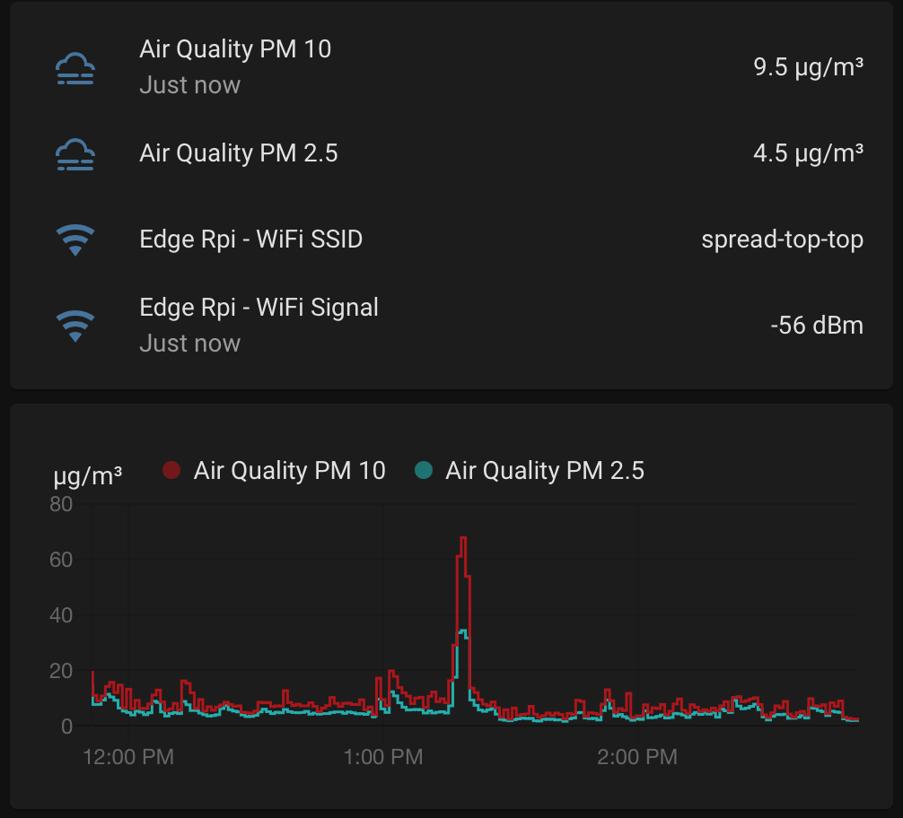
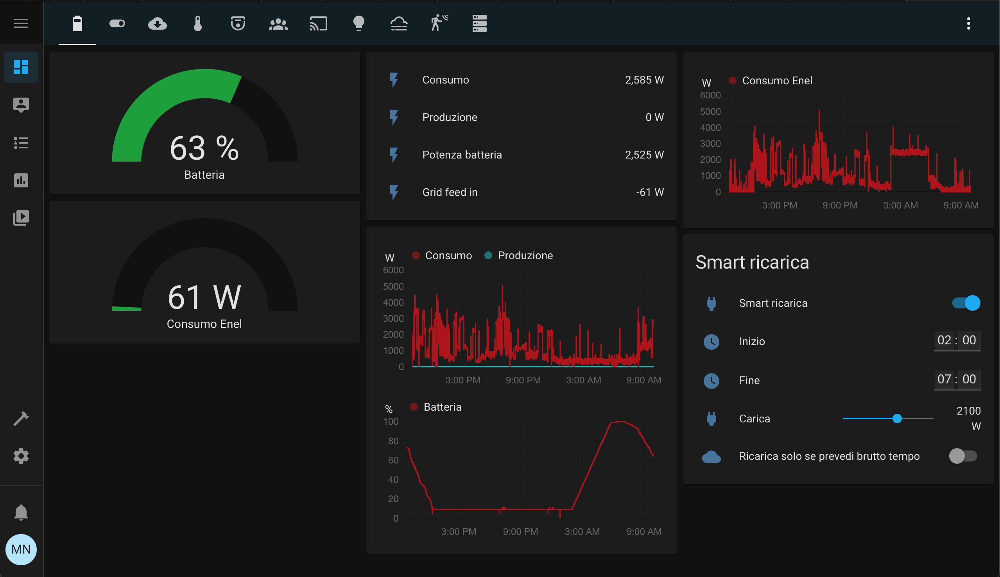
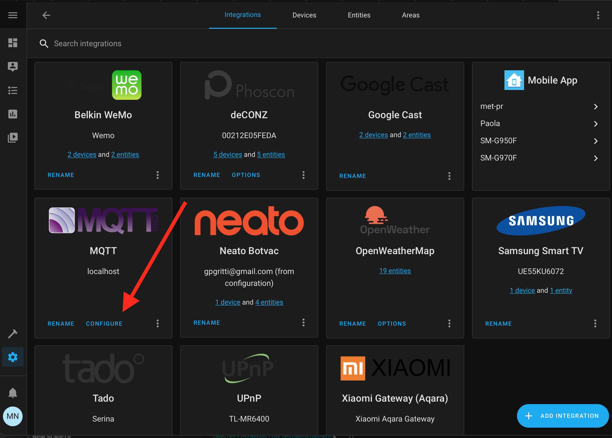
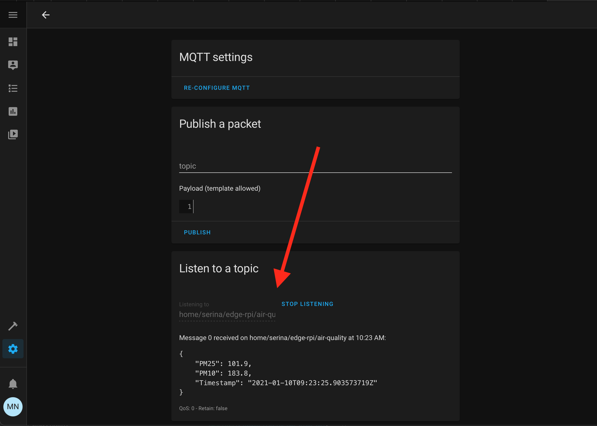
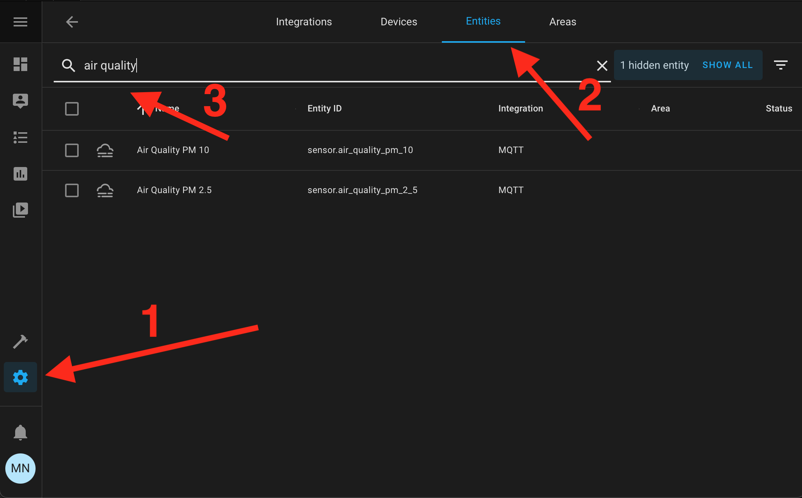
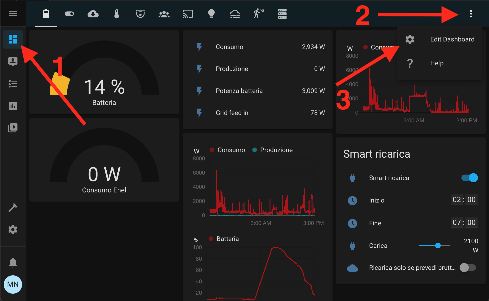
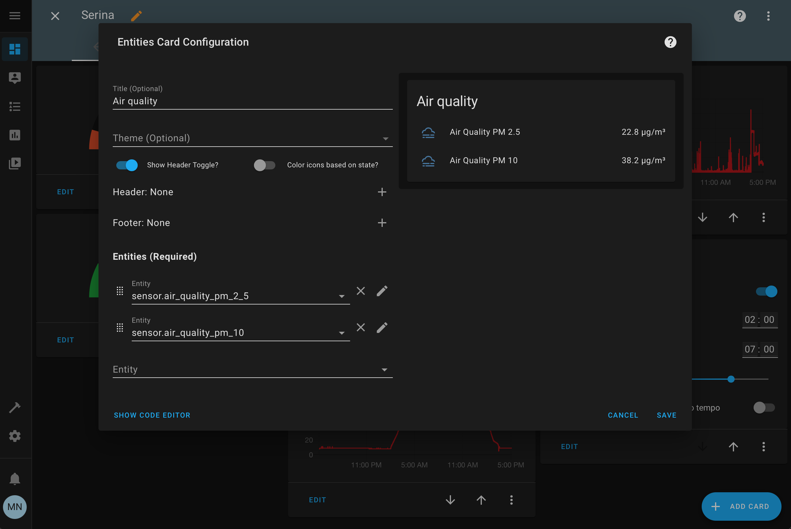
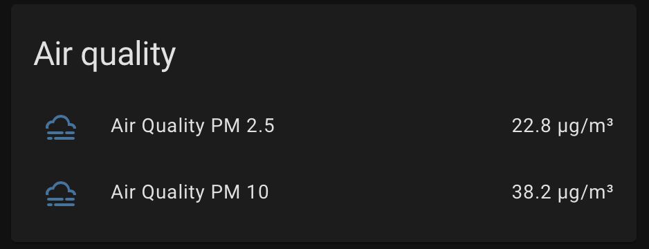
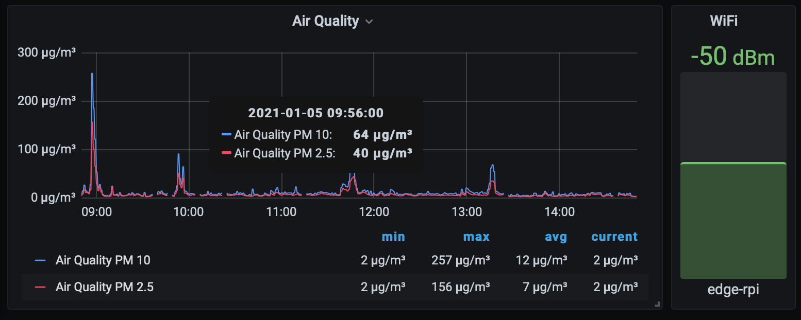

Abito a Milano e mi chiedevo quanto l'aria fosse inquinata. Così ho iniziato a imparare come costruire un sensore per la qualità dell'aria e come integrarlo nel mio Home Assistant. Poi me ne sono pentito perché ho capito che la qualità dell'aria a Milano è terribile! Non è una notizia dell'ultima ora, ma è diverso avere il tuo sensore che analizza l'aria che stai respirando invece di sentire il telegiornale che dice: "Stop del traffico a Milano per abbassare le emissioni perché è sopra i limiti". Poi ho spostato il sensore a Serina, un paesino sperduto tra le montagne, dove la qualità dell'aria è decisamente migliore!

Ora voglio condividere ciò che ho imparato: come creare lo stesso sensore per la qualità dell'aria che ho costruito e come leggere questi dati in Home Assistant proprio in questo modo



## L'hardware necessario

Per raggiungere questo obiettivo abbiamo bisogno di:

- 2 Raspberry Pi con relativo alimentatore e SD Card: uno sarà il sensore per la qualità dell'aria (*Rpi Sensor*), l'altro sarà il nostro ricevitore con Home Assistant (*Rpi Hub*). È inoltre necessario un dongle USB WiFi se il Raspberry Pi di qualità dell'aria non lo ha integrato.
- Il sensore per la qualità dell'aria SDS011: questo hardware viene comunemente fornito con il dongle USB, quindi è facile da collegare al Raspberry Pi.

## Il software che utilizziamo

- [Mosquitto](https://mosquitto.org): broker di messaggi open source che implementa il protocollo MQTT. Il [protocollo MQTT](https://en.wikipedia.org/wiki/MQTT) è ampiamente utilizzato nei sistemi IoT perché funziona molto bene in condizioni estreme come un segnale WiFi debole e larghezza di banda WiFi molto limitata.
- [Home Assistant](https://www.home-assistant.io): sistema domotico open source.

Al momento sto utilizzando un Mac, quindi tutti i comandi che vedi funzioneranno su un terminale Mac o Linux. Se utilizzi Windows hai due opzioni:

- [Installa WSL](https://docs.microsoft.com/en-us/windows/wsl/install-win10).
- Utilizza una macchina virtuale con Linux installato utilizzando [VirtualBox](https://www.virtualbox.org).

## Cosa impariamo

Qualcuno può dire: "Ehi! Sei un bugiardo! Non stai costruendo un sensore per la qualità dell'aria, l'hai appena comprato!". Forse ha ragione, ma penso che il sensore sia solo la punta dell'iceberg. Abbiamo molto lavoro da fare per estrarre i dati dal sensore e renderli utili.

L'architettura complessiva che vogliamo costruire è mostrata nella figura successiva


Quindi, attraverso questo tutorial, impareremo:

- Come creare un programma che estrae i dati dal sensore. Lo scriveremo in [Go](https://golang.org). Per semplificare lo sviluppo impareremo come cross-compilare il binario per l'architettura ARM utilizzando il nostro PC / Mac che ha un'architettura diversa dal Raspberry Pi.
- Come collegare automaticamente il Raspberry Pi con il sensore al WiFi con il segnale più forte, come riconnettersi automaticamente in caso di interruzione.
- Come avviare automaticamente il programma Go in caso di problemi.
- Come passare i dati utilizzando il protocollo MQTT e come digerire quelli all'interno di [Home Assistant](https://www.home-assistant.io).

Ora che abbiamo in mente il quadro generale, iniziamo!

## Costruisci il Raspberry Pi con il sensore per la qualità dell'aria

Cominciamo con il Raspberry Pi con il sensore per la qualità dell'aria.
**La prima cosa di cui abbiamo bisogno è [installare il sistema operativo Raspberry Pi Lite](https://www.raspberrypi.org/documentation/installation/)**. Abbiamo solo bisogno della lite perché usiamo solo il terminale e [ci collegheremo usando SSH](https://www.raspberrypi.org/documentation/remote-access/ssh/README.md).

Ora dobbiamo collegare la scheda SD al Raspberry, collegare la porta ethernet per collegarla alla nostra rete domestica per il primo setup e collegare il sensore SDS011 tramite USB. Il Raspberry Pi dovrebbe rilevarlo automaticamente.

Diamo un'occhiata: connettiamoci a questo Raspberry Pi usando tramite SSH usando `ssh pi@<RPI_SENSOR_IP>`, con password `raspberry`. Cambia "<RPI_SENSOR_IP>" con l'indirizzo IP del sensore Raspberry Pi. Di solito trovo il suo indirizzo IP tramite il pannello di controllo del mio router, o semplicemente digito sul terminale `ping raspberrypi.local`. Dovresti trovare qualcosa di simile

```bash
PING raspberrypi.local (192.168.1.123): 56 data bytes
64 bytes from 192.168.1.123: icmp_seq=0 ttl=64 time=13.452 ms
64 bytes from 192.168.1.123: icmp_seq=1 ttl=64 time=17.451 ms
--- raspberrypi.local ping statistics ---
2 packets transmitted, 2 packets received, 0.0% packet loss
round-trip min/avg/max/stddev = 13.452/15.451/17.451/2.000 ms
```

L'IP che vedi lì, è l'IP che stai cercando.

Ora che siamo connessi tramite SSH, digitiamo `lsusb` per verificare che il Raspberry Pi veda il sensore

```bash
pi@edge-rpi:~ $ lsusb
Bus 001 Device 005: ID 1a86:7523 QinHeng Electronics HL-340 USB-Serial adapter
Bus 001 Device 004: ID 2001:330d D-Link Corp.
Bus 001 Device 003: ID 0424:ec00 Standard Microsystems Corp. SMSC9512/9514 Fast Ethernet Adapter
Bus 001 Device 002: ID 0424:9512 Standard Microsystems Corp. SMC9512/9514 USB Hub
Bus 001 Device 001: ID 1d6b:0002 Linux Foundation 2.0 root hub
```

Dovresti vedere alcuni nomi cinesi come "QinHeng Electronics HL-340". Questo è il nostro sensore. Se digitiamo `ls /dev/ttyUSB*` dovremmo vedere `/dev/ttyUSB0` come risposta: questo è il nostro canale per comunicare con il sensore.

### Compilare il programma Go per recuperare i dati

Ora dovremmo creare un programma che prenda i dati del sensore `/dev/ttyUSB0` creati e li pubblichi su un topic MQTT.

Se non conosci MQTT, non preoccuparti: [Wikipedia spiega brevemente di cosa si tratta](https://en.wikipedia.org/wiki/MQTT). Questa è la mia spiegazione: è un protocollo leggero che si basa sui *topics*. Qualcuno pubblica qualcosa su un topic, come i dati del sensore per la qualità dell'aria. **Qualcun altro può iscriversi a quel topic, in questo modo viene avvisato ogni volta che ci sono nuovi dati su quell'argomento**.

Ho creato questa applicazione per te in Go. [Puoi trovarlo su GitHub](https://github.com/matitalatina/sds011-mqtt).
Dovremmo cambiare la configurazione che si trova in `cmd/sensor/main.go`, il file dovrebbe essere così

```go
package main

import "mattianatali.it/sds011-mqtt/internal/sensor"

func main() {
  c := sensor.Config{
    Topic: "home/serina/edge-rpi/air-quality",
    SensorPortPath: "/dev/ttyUSB0",
    CycleMinutes: 1,
    MqttBroker: "tcp://192.168.1.117:1883",
  }
  sensor.Start(c)
}
```

- Cambia `Topic` con una stringa a tua scelta. La mia convenzione è `home/<HOME_IDENTIFIER>/<DEVICE_IDENTIFIED>/<DATA>`. Il topic è solo una stringa che fa riferimento a dove vogliamo pubblicare i dati e quindi dove vogliamo fare subscribe per recuperarli.
- `SensorPortPath`: dovrebbe essere lo stesso, è dove recuperiamo i dati del sensore.
- `CycleMinutes`: cambialo se 1 campione/minuto è troppo per te. Non puoi mettere meno di 1 minuto.
- `MqttBroker`: Dovresti inserire l'indirizzo IP del Raspberry Pi dove abbiamo messo Mosquitto, il broker di messaggi che gestisce i nostri argomenti MQTT. Ti consiglio di utilizzare lo stesso Raspberry Pi dove installi anche Home Assistant.

Se sei curioso, puoi vedere l'implementazione in `internal/sensor/main.go`.

**Ora è il momento di compilarlo per il nostro Raspberry Pi!** Mi aspetto che tu abbia scaricato questo codice sorgente sul tuo Mac / PC e che tu abbia [Go installato](https://golang.org/doc/installare). Quindi, dobbiamo sapere che tipo di architettura ha il tuo Raspberry Pi.

Lancia questo comando sul Raspberry Pi: `cat /proc/cpuinfo`
Dovresti vedere qualcosa di simile

```bash
cat /proc/cpuinfo

processor : 0
model name : ARMv6-compatible processor rev 7 (v6l)
BogoMIPS : 697.95
Features : half thumb fastmult vfp edsp java tls
CPU implementer : 0x41
CPU architecture: 7
CPU variant : 0x0
CPU part : 0xb76
CPU revision : 7

Hardware : BCM2835
Revision : 0002
Serial : 00000000cdea9a84
Model : Raspberry Pi Model B Rev 1
```

Il mio Raspberry ha "ARMv6", quindi devo compilare per quel tipo. Se hai un Raspberry Pi 2 dovresti vedere "ARMv7".
Ho creato un [Makefile](https://github.com/matitalatina/sds011-mqtt/blob/main/Makefile) per semplificare la cross-compilazione. Il makefile è molto comune su Linux, viene utilizzato per semplificare le attività comuni. Se non lo sai, ti suggerisco di leggere [Learn make in Y minutes](https://learnxinyminutes.com/docs/make/).

- Se hai `ARMv6`, digita semplicemente `make build-arm6` nella cartella in cui hai scaricato il mio [progetto GitHub](https://github.com/matitalatina/sds011-mqtt).
- Se hai `ARMv7`, digita `make build-arm`.

Ora dovremmo avere un file binario situato in `dist/pm-sensor`. Dovremmo trasferire al nostro sensore sul Raspberry Pi. Useremo il comando [scp](https://linuxize.com/post/how-to-use-scp-command-to-securely-transfer-files/).

```bash
scp dist/pm-sensor pi@<RPI_SENSOR_IP>:
```

Come al solito, cambia `<RPI_SENSOR_IP>` con l'IP reale, ma lascia i due punti alla fine. Ciò significa che posizioneremo il `pm-sensor` nella cartella home del nostro utente `pi` all'interno del Raspberry Pi.

Ora possiamo entrare tramite SSH nel Raspberry Pi, dovremmo vedere il nostro nuovo file binario chiamato `pm-sensor`. Se proviamo a farlo partire, fallisce

```bash
# Aggiungi il permesso di esecuzione allo script
sudo chmod +x ./pm-sensor
# Fallo partire
./pm-sensor
# Questo è l'output del programma
panic: Network Error : dial tcp 192.168.1.118:1883: connect: connection refused

goroutine 1 [running]:
mattianatali.it/sds011-mqtt/internal/sensor.Start(0x12d3bcd, 0x20, 0x12cc844, 0xc, 0x1, 0x12d0ec0, 0x18)
 /Users/mattia/Repositories/sds011-mqtt/internal/sensor/main.go:28 +0x7e5
main.main()
 /Users/mattia/Repositories/sds011-mqtt/cmd/sensor/main.go:12 +0xac
```

si lamenta perché non riesce a connettersi al broker MQTT per pubblicare i dati del sensore. Ha ragione, non abbiamo preparato l'altro Raspberry Pi.

Ora lasciamo per un attimo il sensore, e lavoreremo sul Raspberry Pi che si trova all'interno della nostra casa, lo chiamiamo *Hub* per semplicità.

## Aggiungiamo mosquitto al Raspberry Pi hub

**Ora è il momento di configurare la parte "ricevitore" dell'architettura.** Quindi abbiamo bisogno dell'altro Raspberry Pi con installato un sistema operativo Raspberry pulito.

Quindi [installiamo Mosquitto](https://mosquitto.org/blog/2013/01/mosquitto-debian-repository/)

```bash
wget http://repo.mosquitto.org/debian/mosquitto-repo.gpg.key
sudo apt-key add mosquitto-repo.gpg.key
cd /etc/apt/sources.list.d/
sudo wget http://repo.mosquitto.org/debian/mosquitto-buster.list
apt-get update
sudo apt-get install mosquitto
```

La nuova versione di Mosquitto [ha aggiunto l'autenticazione di default per ottime ragioni](https://mosquitto.org/blog/2020/12/version-2-0-0-released/). Ho iniziato questo progetto quando Mosquitto non aveva l'autenticazione abilitato di default, quindi il mio script non lo supporta ancora. Per abilitare il supporto per gli utenti anonimi dovremmo aggiungere queste due righe nel file `/etc/mosquitto/mosquitto.conf`

```
listener 1883
allow_anonymous true
```

Il primo abilita i messaggi in arrivo da diversi host alla porta `1883`. Ciò è necessario perché il nostro sensore non è su questo Rpi Hub. Il secondo abilita gli utenti anonimi.

**Ci assicuriamo che Mosquitto funzioni**, prenda il nuovo file di configurazione e **si avvia all'avvio di Raspberry**.


```bash
# Restart mosquitto to get the new config file
sudo systemctl restart mosquitto

# Make sure mosquitto is enabled on startup
sudo systemctl enable mosquitto
```

**Ora abbiamo il Broker MQTT attivo e funzionante!** Significa che il nostro sensore può inviare i dati a questo broker. Testiamo se il nostro sensore può inviare dati a questo broker.

```bash
# Connetti al Raspberry Pi sensor e digita la password
ssh pi@<RPI_SENSOR_IP>
# Fai partire il programma per inviare i dati sulla qualità dell'aria
./pm-sensor
# Questo è l'output atteso (1 linea ogni minuto)
2021-01-06T05:58:15Z,8.4,21
2021-01-06T05:59:15Z,10.5,60.9
2021-01-06T06:00:15Z,8.5,48.9
2021-01-06T06:01:15Z,12.3,99.5
2021-01-06T06:02:15Z,20.1,214.3
2021-01-06T06:03:14Z,17.6,183.2
2021-01-06T06:04:14Z,16.5,173.7
2021-01-06T06:05:14Z,10.4,52.2
```

Questo è davvero un buon segno! Significa che possiamo recuperare i dati dal nostro sensore e possiamo inviarli al nostro broker MQTT che è installato sul nostro Hub Raspberry Pi!

Per fare una contro prova, **lasciamo il programma attivo** e facciamo subscribe sul topic a cui stiamo inviando i dati

```bash
# Ci colleghiamo a Raspberry Pi Hub
ssh pi@<RPI_HUB_IP>
# Facciamo subscribe al topic
mosquitto_sub -t 'home/serina/edge-rpi/air-quality'
# Dovremmo vedere un output come questo
{"PM25":14.8,"PM10":18.6,"Timestamp":"2021-01-06T13:42:08.33019206Z"}
{"PM25":14.5,"PM10":16.2,"Timestamp":"2021-01-06T13:43:08.192798603Z"}
{"PM25":8.7,"PM10":9.7,"Timestamp":"2021-01-06T13:44:08.057092356Z"}
```

Dovresti cambiare `<RPI_HUB_IP>` con l'IP del tuo Hub e sostituire `home/serina/edge-rpi/air-quality` con l'argomento che hai inserito nella configurazione Go all'interno della proprietà `Topic`.

Ora sappiamo cosa pubblica sull'argomento il nostro programma Go: invia un file JSON con tre proprietà:

- "PM25": contiene il PM 2.5 espresso in `µg/m^3`.
- "PM10": contiene il PM 10 espresso in `µg/m^3`.
- `Timestamp`: contiene l'ora in [ISO 8601](https://en.wikipedia.org/wiki/ISO_8601) in cui ha recuperato i dati.

### Riepilogo

Congratulazioni! **Ora abbiamo un sensore che recupera i dati sulla qualità dell'aria e li invia a un broker MQTT, ogni applicazione che desidera questi dati dovrebbe iscriversi al topic scelto** e il gioco è fatto! Abbiamo finito?

Beh... Non esattamente.

Vogliamo mettere il sensore all'esterno, quindi dovremmo usare il WiFi e staccare la porta Ethernet. Non vogliamo collegarci al sensore per avviare il programma. Se mettiamo il sensore lontano dal nostro router, il sensore dovrebbe essere in grado di ricollegarsi automaticamente ogni volta, dovrebbe fare lo stesso se riavviamo il router. Abbiamo tutti questi problemi da risolvere!

Quindi potenziamo il nostro sensore per renderlo wireless e abbastanza intelligente da mantenere la connessione automaticamente.

## Potenziamo il sensore!

### Avviare automaticamente il programma

Il programma non si avvia automaticamente. Dobbiamo connetterci tramite SSH e avviarlo con il comando `./pm-sensor`. Questo è molto frustrante.

Per raggiungere questo obiettivo, **utilizziamo [systemd](https://en.wikipedia.org/wiki/Systemd)**. Systemd è il gestore di sistema e servizi per Raspberry Pi. Hai notato che abbiamo già utilizzato systemd in questo tutorial? Quando abbiamo avviato mosquitto abbiamo scritto

```bash
sudo systemctl restart mosquitto
sudo systemctl enable mosquitto
```

usando il comando `systemctl` possiamo avviare / arrestare / riavviare i servizi su una macchina Linux. E possiamo anche avviare automaticamente un servizio all'avvio se scriviamo `sudo systemctl enable <SERVICE>`. Quindi dobbiamo creare un servizio per il nostro programma di sensori pm.

Fortunatamente è molto semplice: i servizi personalizzati sono archiviati nella cartella `/etc/systemd/system`. Quindi possiamo aggiungere il nuovo servizio, se aggiungiamo il file chiamato `pm-sensor.service` in quella cartella. Il contenuto di quel file è il seguente

```
[Unit]
Description=PM Air Quality Sensor
After=network-online.target
Wants=network-online.target

[Service]
Type=simple
User=pi
Group=pi
ExecStart=/home/pi/pm-sensor
Restart=always
RestartSec=10

[Install]
WantedBy=multi-user.target
```

Come puoi vedere, la dichiarazione del servizio è composta da tre sezioni: `[Unit]`, `[Service]` e `[Install]`.

- Nella sezione "[Unit]" mettiamo una piccola descrizione del nostro servizio e dichiariamo che vogliamo che la rete sia attiva e funzionante prima di avviarla.
- `[Service]` dichiara il tipo di servizio, il nome e il gruppo dell'utente che dovrebbe avviare lo script, dove si trova il programma e definiamo come dovrebbe comportarsi systemd in caso di panico del servizio. Vogliamo che il programma si riavvii sempre.
- `[Install]` definisce che questo servizio non necessita dell'interfaccia utente grafica.

Systemd è un argomento molto vasto e merita un libro completo su di esso. So che questa spiegazione è molto sommaria, ma è sufficiente per i nostri scopi. Ma so che sei molto curioso! Quindi, se vuoi scavare più a fondo, puoi digitare `man systemd.unit` e `man systemd.service` sulla tua macchina Linux. In Linux, se vuoi sapere qualcosa di più basta digitare `man <PROGRAM_YOU_WANT_TO_LEARN_MORE>`.

Ora che abbiamo creato il servizio, dobbiamo ricaricare la configurazione di systemd, avviare il programma e abilitarlo durante l'avvio.

```bash
sudo systemctl daemon-reload
sudo systemctl start pm-sensor
sudo systemctl enable pm-sensor
```

Possiamo verificare se tutto è avviato correttamente con il seguente comando

```bash
sudo systemctl status pm-sensor
# Questo è l'output che abbiamo ottenuto
● pm-sensor.service - PM Air Quality Sensor
 Loaded: loaded (/etc/systemd/system/pm-sensor.service; enabled; vendor preset: enabled)
 Active: active (running) since Wed 2021-01-06 15:01:26 GMT; 1h 43min ago
 Main PID: 1182 (pm-sensor)
 Tasks: 5 (limit: 272)
 CGroup: /system.slice/pm-sensor.service
 └─1182 /home/pi/pm-sensor

Jan 06 16:36:01 edge-rpi pm-sensor[1182]: 2021-01-06T16:36:01Z,21.2,33.9
Jan 06 16:37:00 edge-rpi pm-sensor[1182]: 2021-01-06T16:37:00Z,61.1,303.4
```

Se tutto è corretto, dovremmo vedere anche i log del nostro programma.

Non è più necessario avviare manualmente il programma! Ma siamo ancora connessi tramite Ethernet, non possiamo mettere il nostro sensore fuori casa. Risolviamo il problema!


### Aggiungere la connessione WiFi

Il modo migliore per aggiungere il WiFi al Raspberry Sensor è [leggendo la documentazione ufficiale](https://www.raspberrypi.org/documentation/configuration/wireless/wireless-cli.md), è inutile fare copia-incolla. Ti suggerisco di aggiungere tutti i tuoi WiFi SSID che hai a casa. In questo modo, imposti il ​​sensore solo una volta. Se desideri spostarlo in un altro luogo, proverà a connettersi al punto di accesso WiFi più vicino.

Tieni presente che ora **l'indirizzo IP del sensore potrebbe essere cambiato**. Quindi ricordati di trovare il nuovo indirizzo.

### Mantenere il WiFi persistente

Ora possiamo mettere il nostro sensore all'esterno! Si connette automaticamente al nostro WiFi e avvia il nostro programma che recupera il sensore. Dovremmo essere orgogliosi del nostro lavoro fatto fino ad ora... Ma ci rendiamo presto conto che c'è un problema. Ce ne rendiamo conto quando riavviamo il nostro router o mettiamo il nostro sensore troppo lontano da esso: **il Raspberry Pi non prova a ricollegare il WiFi se perde la connessione**!

Sistemiamo. Ho trovato un piccolo script sul web e l'ho adattato per i nostri scopi. Creiamo il file `check-wifi.sh`

```bash
# Connettiti al Raspberry Pi sensor
ssh pi@<RPI_SENSOR_IP>

# Crea il nuovo file
touch check-wifi.sh

# Aggiungi il permesso di esecuzione su di esso
chmod +x check-wifi.sh
```

mettiamo questo contenuto al suo interno

```bash
#!/bin/bash

##################################################################
# Impostazioni
# Quale interfaccia vuoi controllare
wlan='wlan0'
# Quale indirizzo vuoi eseguire il ping per vedere se l'interfaccia di rete è attiva?
pingip='192.168.1.1'
##################################################################

echo "Performing Network check for $wlan"
/bin/ping -c 1 -I $wlan $pingip > /dev/null 2> /dev/null
if [ $? -ge 1 ] ; then
  echo "Network connection down! Attempting reconnection."
  sudo ip link set $wlan down
  sleep 5
  sudo ip link set $wlan up
else
  echo "Network is Okay"
fi
```

Lo script dovrebbe essere autoesplicativo. Abbiamo due variabili in alto: `wlan` che non dovresti cambiare e `pingip` dove metti l'indirizzo IP del tuo router.

Lo script tenta di eseguire il ping del router: se raggiunge il router, va tutto bene. Se non può farlo: disabilita il WiFi, quindi si riattiva. Dovrebbe attivare la riconnessione.

**Abbiamo bisogno di qualcuno che chiami questo script ogni minuto... [cron](https://en.wikipedia.org/wiki/Cron) ci viene in soccorso!** Questo applicativo è uno standard per fare queste cose su Linux.

Per aggiungere un lavoro pianificato che attivi il nostro script ogni minuto, dobbiamo scrivere `crontab -e` nel terminale. Si aprirà un editor di testo.
In quella pagina scrivi questa cosa

`` bash
* * * * * /home/pi/check-wifi.sh
`` `

Questa strana sintassi può spaventare ma è molto semplice. La prima parte, `* * * * *` indica quando lo script deve essere attivato. L'ultima parte si riferisce allo script che vogliamo lanciare.
L'orario programmato è sempre rappresentato da cinque valori. L'ordine di questi cambia il significato di quegli asterischi. Da sinistra a destra si riferiscono a:

- Minuto (0-59)
- Ora (0-23)
- Giorno del mese (1 - 31)
- Mese (1-12)
- Giorno della settimana (0 - 6): da domenica a sabato

Ma mettiamo `*`... Non numeri. Abbiamo aggiunto degli asterischi perché hano un significato speciale. `*` significa "qualsiasi". Così abbiamo scritto: "Per favore Linux, esegui lo script `/home/pi/check-wifi.sh` ogni minuto di ogni ora di ogni giorno del mese di ogni giorno della settimana". Linux è abbastanza intelligente da capire che dovrebbe attivare lo script ogni minuto d'ora in poi.

**Ora abbiamo un sensore per la qualità dell'aria molto robusto!** Possiamo metterlo fuori casa e, qualunque cosa accada, dovrebbe mantenere sempre la connessione finché raggiunge il segnale WiFi del nostro router.

**Usare `mosquitto_sub` è l'unico modo per vedere i dati dal sensore**. Questo va bene solo per scopi di debug, dovremmo avere un modo migliore per vedere quei dati. **[Home Assistant](https://www.home-assistant.io) risolverà questo problema**.

## Aggiungi il sensore a Home Assistant

### Installa e impara Home Assistant

[Home Assistant](https://www.home-assistant.io) è un ottimo software. Se sei un appassionato di tecnologia che ama automatizzare la casa, penso che tu l'abbia già installato.

Se ancora non lo sai: puoi collegare dispositivi intelligenti e creare regole per automatizzare i tuoi dispositivi domotici. Puoi anche collegare i sensori per vedere facilmente i dati. In altre parole, se decidi di installarlo, Home Assistant può diventare il centro di controllo della tua casa.

**Il nostro obiettivo qui è vedere i dati del sensore nell'Home Assistant.**

Come primo passo, [dobbiamo installarlo](https://www.home-assistant.io/docs/installation/) sul Raspberry Pi hub.
Quindi, ti suggerisco di leggere il [manuale di configurazione](https://www.home-assistant.io/docs/configuration/). Home Assistant utilizza pesantemente i [file YAML](https://learnxinyminutes.com/docs/yaml/) per installare sensori personalizzati come il nostro.

Forse stai pensando che Home Assistant sia eccessivo per vedere solo i dati del sensore. Ma penso che questo sia solo il punto di partenza: sono sicuro che alla fine avrai più di 20 dispositivi con un totale di 200 sensori collegati e dozzine di automazioni che orchestrano tutto!



Quindi non è eccessivo, è solo il nostro punto di partenza, credimi 😊.

Ora che abbiamo installato Home Assistant e imparato a conoscere [dove è installata la sua configurazione](https://www.home-assistant.io/docs/configuration/), **è ora di aggiungere il nostro sensore**.

### Aggiungere l'integrazione MQTT

**Dobbiamo aggiungere l'integrazione MQTT a Home Assistant.** Andiamo sul portale Home Assistant, dovrebbe essere esposto sulla porta `8123`. Quindi apri il browser e digita l'URL `http://<RPI_HUB_IP>:8123` dove `<RPI_HUB_IP>` è l'IP del nostro Raspberry Pi Hub. Fai clic sull'icona a forma di ingranaggio (Configurazione) e fare clic su "Aggiungi integrazione". Possiamo vedere un enorme elenco di integrazioni, siamo interessati a MQTT. Quindi cercalo e poi chiederà due campi obbligatori:

- Broker: è necessario aggiungere l'IP dell'hub Raspberry Pi. È dove abbiamo installato Mosquitto, il nostro broker MQTT.
- Porta: è `1883`. Lo avevamo messo nella configurazione mosquitto.

Fai clic su Invia e ora abbiamo collegato Home Assistant al nostro broker MQTT Mosquitto.

Dovremmo vedere la nuovissima integrazione in Configurazione -> Integrazioni. Facciamo clic su configura



e poi possiamo fare subscribe del nostro topic MQTT, solo per verificare se Home Assistant può vedere i nostri dati.

Nella sezione "Subscribe topic", inserisci il nostro topic MQTT, fai clic su "Start listening" e attendi almeno 1 minuto. L'attesa dipende dalla configurazione impostata sul nostro programma Go. Se non modifichi il mio valore, dovrebbe pubblicare un valore al minuto.

Se vedi i dati come la figura sotto, hai collegato con successo Home Assistant al nostro Broker MQTT!




### Aggiungere i sensori di qualità dell'aria tramite la piattaforma MQTT

Sappiamo che i valori sono pubblicati su un argomento MQTT (il mio è `home/serina/edge-rpi/air-quality`). Dovremmo creare due sensori che fanno subscribe sul topic ed estraggono i dati. Questi sensori lo saranno

- Qualità dell'aria PM 10.
- Qualità dell'aria PM 2.5.

Per raggiungere questo obiettivo, modifichiamo il file `configuration.yaml` di Home Assistant. Dobbiamo aggiungere questi due sensori all'interno della sezione `sensor:`.

```yaml
sensor:
  - platform: mqtt
    state_topic: "home/serina/edge-rpi/air-quality"
    unit_of_measurement: "μg/m³"
    icon: "mdi:weather-fog"
    value_template: '{{value_json.PM10 | float}}'
    name: 'Air Quality PM 10'
    unique_id: 'rpi-edge:air-quality-pm-10'
  - platform: mqtt
    state_topic: "home/serina/edge-rpi/air-quality"
    unit_of_measurement: "μg/m³"
    icon: "mdi:weather-fog"
    value_template: '{{value_json.PM25 | float}}'
    name: 'Air Quality PM 2.5'
    unique_id: 'rpi-edge:air-quality-pm-2.5'
```

Fortunatamente, il file YAML è molto leggibile. Stiamo utilizzando la [piattaforma sensor MQTT](https://www.home-assistant.io/integrations/sensor.mqtt/). Riavvia Home Assistant.

Dovresti cambiare `state_topic` con il tuo. Puoi anche cambiare `unique_id` con qualsiasi valore, basta che sia univoco.

`value_template` è il campo dove estraiamo il valore da JSON nell'argomento con la parola chiave `value_json` e poi prendiamo i valori interessanti `PM10` e `PM25`. Infine, diciamo che siamo interessati a un valore di tipo `float`, ossia con la virgola. Tutta questa roba è circondata da `{{}}`: quando vedi questa sintassi significa che stiamo sfruttando il [motore di templating](https://www.home-assistant.io/docs/configuration/templating/) che sfrutta [Jinja2](https://www.home-assistant.io/docs/configuration/templating/).

Se vuoi cambiare l'icona del sensore, di solito [uso questo sito](https://materialdesignicons.com). Ad esempio, cerco
per una parola chiave, `fog`, e infine passo il mouse sull'icona scelta. Dovresti anteporre al nome che appare con `mdi:`. Nel nostro esempio è `mdi:weather-fog`.


## Aggiungere i sensori all'interfaccia utente di Home Assistant

Ora dovremmo avere due nuove entità che mostrano la qualità dell'aria. Per vederli, dovremmo andare su configurazione -> entità e cercare "Qualità dell'aria"



come puoi vedere, è abbastanza scomodo. È meglio inserire queste entità nella pagina panoramica / dashboard.

Nell'Home Assistant, fai clic su Panoramica sulla barra di sinistra, i tre punti sulla destra, Modifica dashboard e infine "Aggiungi scheda" in basso. Dovrebbe apparire una modale, fare clic sulla scelta "Entità".



Scrivi il titolo che desideri; nella sezione "entità", cerca le entità che abbiamo visto in precedenza. Dovresti vedere un'anteprima della nuova carta in basso. Quando sei soddisfatto, fai clic su "Salva" ed il gioco è fatto!



Ora dovremmo avere questa bella card ogni volta che apriamo Home Assistant! Se clicchiamo su questo, dovremmo vedere anche un grafico che riguarda l'ultimo giorno.



## Conclusioni

Finalmente arriviamo alla fine di questo viaggio. Spero che tu abbia imparato qualcosa di nuovo e apprezzi la bellezza di creare un sensore per la qualità dell'aria da solo.

Vorrei raccontarvi di più a riguardo: ad esempio, non ho spiegato come vedere questi dati su [Grafana](http://grafana.com)



o come vedere l'SSID WiFi e la sua potenza del segnale direttamente su Home Assistant.


Ne parlerò in altri post del blog perché questo è già molto lungo.

Se vuoi essere aggiornato lascia la tua email qui sotto e ti avviserò. O semplicemente visita il mio blog di tanto in tanto.

Alla prossima!
